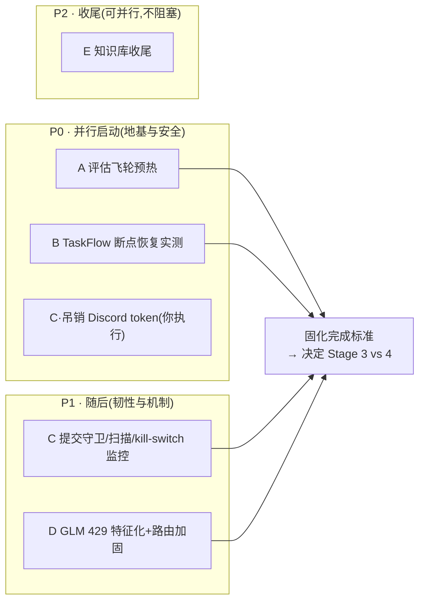

# OpenClaw + Harness 固化加固方案(Stage 2.5 · Consolidation)

## ——进新阶段之前的一次"稳态停留":夯地基 / 清债务 / 预热评估飞轮

> 版本:v3.0-S2.5 | 撰写日期:2026-07-03
> 承接文档:`IMPLEMENTATION-LOG.md`(Stage 0-2 完成并验证)、`openclaw-harness-v3-unified.md`(v3 方案,章节引用记为 v3 §x)
> 定位:**不是新功能阶段**。在推进 Stage 3(MCP+能力装配,当前暂缓)或 Stage 4(多角色协作)之前,先把 Stage 2 的遗留债务清掉、把无人值守所依赖的韧性补齐、把 Stage 5 前置的评估飞轮预热到"有数据可用"。完成后系统从「演示级闭环」抬升到「可无人值守的稳态」,并产出"下一步走 3 还是 4"的量化依据。

---

## 目录

0. [为什么先固化,而不是进新阶段](#0-为什么先固化而不是进新阶段)
1. [现状与债务诊断](#1-现状与债务诊断)
2. [五条固化工作流](#2-五条固化工作流)
3. [优先级与时序](#3-优先级与时序)
4. [固化完成标准(进入 Stage 3/4 的门槛)](#4-固化完成标准进入-stage-34-的门槛)
5. [风险与回退](#5-风险与回退)
6. [与 v3 方案 / 日志的映射](#6-与-v3-方案--日志的映射)

---

## 0. 为什么先固化,而不是进新阶段

三条理由,每条都对应 v3 已确立的原则:

1. **"跑通"≠"稳态"**:Stage 0-2 在 2026-07-02 当天从零重建后闭环,编码闭环、TaskFlow 三步流、三态路由都是**首次单跑通过**,尚未经过故障注入、并发压力、跨重启的验证。无人值守的前提是这些路径在异常下也成立。
2. **停留是被 v3 明文许可的正确决策**:v3 §4 写明"如果触发信号一直不出现,永远停留在形态一/二是正确决策,不是保守"。Stage 3 已按你的决定暂缓(无外部应用需求),此时不硬推新阶段,而是加固当前形态一,完全符合"用触发条件驱动升级"的制度。
3. **Stage 4/5 的前置尚未就位**:Stage 5 自进化的门禁依赖 golden set,而候选池现仅 2 条;Stage 4 多角色协作会放大 token 消耗与失败面,却建立在"TaskFlow 断点恢复未实测"的假设之上。先补前置,后续无论走 3 还是 4 都更稳。

**本阶段唯一新增产出物是"决策依据"**:固化后,评估飞轮 + 成本账本能用数据回答"下一阶段该接外部应用(Stage 3)还是先做多角色(Stage 4)",把 v3 §4 的"用可观测数据说话"落到这次分叉决策上。

---

## 1. 现状与债务诊断

当前处于**形态一 · 单机加固版**:单 main agent + 回环 Gateway + token 认证,Stage 0-2 完成。已验证能力与松动点如下(松动点即本阶段的作业面):

| # | 债务/松动点 | 来源(日志) | 现状 | 若不处理的风险 | 归属工作流 |
|---|---|---|---|---|---|
| 1 | 评估飞轮极薄 | Stage 2「golden 候选池 2 条」 | 仅 2 条候选,无分类基线、无回放门禁 | Stage 5 无客观门禁 ⇒ 自进化退化为"模型自评+人工抽查"(v3 §1 第 3 条最大缺口) | **A** |
| 2 | TaskFlow 断点恢复未实测 | 关键决议 4 | 留待"首个真实长任务顺带验证",至今空白 | 无人值守长任务的恢复语义是假设;重启即丢进度则熔断计数/预算也可能被重置绕过 | **B** |
| 3 | 旧 Discord token 安全债 | 渠道决议 / 路由基线 | 9-bot token 曾明文存放,"建议去开发者后台吊销",是否已吊销未确认 | 明文凭据长期挂着 = 持续暴露面;`~/.openclaw` 曾两次密钥入库(已净化)说明防线有缺口 | **C** |
| 4 | GLM 白天多次 429 | 已知观察项 | 回退链(glm-5.2→gpt-5.5)能接管,但 429 频发未特征化 | 降级态(有线断)下主模型不稳,成本/延迟被动上升且不可见 | **D** |
| 5 | 网络脆弱不变式 | 网络架构 / 观察项 | NordVPN kill-switch"必须保持关闭";AX88179A USB 网卡曾整段断链误诊 | 误开 kill-switch 断本地推理;物理层故障被误诊为 VPN | **C/D** |
| 6 | 知识库收尾未决 | 知识库迁移 | 迁移已验证(94 文件/806 chunks),但旧 `~/Knowledge` 与 Neovim 工具链物理保留待确认 | 双份真相源易漂移;冗余目录长期悬置 | **E** |

已验证、**本阶段不动**的部分(仅做回归确认,不重构):审批拦截、provenance 记忆治理、本机 Ollama bge-m3 语义检索、晨报+治理摘要心跳、ACP→Claude Code 编码闭环、迭代/预算双熔断的基本触发、三态路由的正常切换。

---

## 2. 五条固化工作流

### 2.1 工作流 A — 评估飞轮预热(golden set 扩充)【P0】

**目标**:把 golden set 从 2 条抬到"每类 10-20 条 + 有分类通过率基线",让 §3.4 评估层从纸面变成每天运转的飞轮。这是本阶段**最高价值项**——它既是 Stage 5 门禁的前置,又立刻为日常质量监控提供基线。

**动作**:

1. **定 schema(一次性,对齐 OTel GenAI 语义约定)**:每条用例含 `input`、`task_type`、结构化断言 `assertions[]`(如"输出必含字段 X""测试必过""不得调用 Y 类工具""成本 ≤ N token")、`weight`、`provenance`(seed / harvested)。落地为形态一约定的「SQLite 用例库 + 回放脚本 + Heartbeat 评估任务」,不引独立评估平台(v3 §3.4)。
2. **分类种子**:优先有生产轨迹的类别——**编码**(Stage 2 的 FizzBuzz+7 用例及后续编码任务脱敏入库)、**问答/检索**(知识库 94 文件的真实检索问答)、**项目同步**(vault 内 <your-project> 等真实周报链路)。**分诊**类先人工种子起步(暂无足量真实轨迹)。每类目标 10-20 条。
3. **建基线**:全量回放一次,记录每类当前通过率作为**回归基线**。Stage 5 的进化门禁(通过率 ≥ 参考 90% 且不使其他类下降)即以此为锚。
4. **接生产采样评估**:按 5-10% 抽样已完成任务,轻量模型按 rubric(完成度/是否偏题/成本合理性)打分,结果并入晨报的成本/质量摘要(复用 v1 §5.1 晨报机制)。

**产出**:`eval/golden/` 下各类种子用例 + 回放脚本 + 基线报告一份;晨报新增"质量分/采样评估"栏。
**验收**:5 类中至少 3 类(编码、问答/检索、项目同步)各 ≥10 条并跑出基线;回放脚本可一键复跑;连续 3 日晨报含质量分。

### 2.2 工作流 B — TaskFlow 断点恢复实测【P0】

**目标**:把关键决议 4 从"未实测"变成"实测通过 + 恢复语义写入 `learnings.md`"。TaskFlow 是长任务的骨架(v3 §3.1),且是 2026.3.31 新层、含破坏性变更(移除 `nodes.run`),恢复语义不能靠假设。

**测试设计(受控,非关键任务上做)**:

1. 构造一个 ≥5 步、跨阶段带 checkpoint 的 flow(可复用 Stage 2 已通过的三步流扩展)。
2. **故障注入**:在每个阶段边界 `kill` Gateway 进程,再 `start`,验证 flow 从最近持久化 checkpoint **续跑**而非从头重来。
3. **熔断跨重启一致性(关键)**:验证恢复后**迭代计数与预算消耗被正确保留**——若重启重置计数,则迭代熔断/预算熔断可被"重启-再跑"绕过,这是无人值守下的隐性失控入口,必须堵死。
4. **ESCALATED 对接**:在断点触发升级人工时,验证其正确写入统一审批队列(`governance/approvals/queue.md`)而非静默丢失。

**产出**:一份恢复语义记录(什么状态存活/什么丢失/熔断计数是否持久)入 `learnings.md`;更新决议 4 状态。
**验收**:kill/restart 后 flow 续跑成功;熔断计数跨重启不清零;断点 ESCALATED 正确入队。若发现恢复语义不满足,则按 v3 §3.1"自建调度设计保留为附录"启动后备预案评估。

### 2.3 工作流 C — 安全债清理【P0(吊销) / P1(其余)】

**目标**:关掉明文凭据暴露面,把"曾两次密钥入库"的教训固化成机制,让网络不变式可监控。

**动作**:

1. **【P0·你执行】吊销旧 9-bot Discord token**:去 Discord 开发者后台逐个吊销/重置(路由基线明确建议)。这是**时间敏感项**——旧 token 曾明文存放,越晚吊销暴露越久。
2. **残留扫描**:对当前 `~/.openclaw` 配置、环境变量、Git 历史做一次凭据扫描,确认 WebChat 单渠道配置确实无外部渠道 token(攻击面已最小化,做一次实证)。
3. **提交守卫(防第三次入库)**:给 `~/.openclaw` 仓库加 pre-commit secret-scan 钩子。前两次密钥入库虽已历史净化,但缺乏机制上的拦截;钩子把"净化"从事后补救变成事前阻断。
4. **备份凭据处置**:`backups/openclaw-config-backup-*.tar.gz` 含 credentials/,书面确认其存放位置**不在任何云端/Git 远端**,并记入本阶段决议。
5. **kill-switch 不变式监控**:模型路由切换器已在不可达时日志提示"check NordVPN kill-switch";把它升级为**主动心跳探测 + 告警**——一旦本地推理路径不可达且疑似 kill-switch 误开,主动推送而非等推理失败反推。

**产出**:token 吊销确认、扫描报告、pre-commit 钩子、备份处置决议、kill-switch 心跳探测项。
**验收**:9 个 token 全部吊销;扫描无残留;钩子能拦截构造的假密钥提交;心跳能在 kill-switch 误开时告警。

### 2.4 工作流 D — 运行韧性(GLM 429 + 路由)【P1】

**目标**:把"GLM 白天多次 429"从被动接管变成**特征化 + 可见 + 有策略**,顺带堵住物理层误诊。

**动作**:

1. **特征化**:用成本/trace 账本(v3 §3.5 已记 token×单价)统计 429 的**频次分布与触发时段**,判定是配额型(查智谱配额)还是每分钟速率型。注:novasky 本地(有线可达)是首选路径,GLM 仅在**有线断的降级态**才是主模型——所以 429 的实际影响集中在降级态,据此定策略。
2. **选策略(三选一/组合)**:(a) 申请配额上调;(b) 命中回退前加请求节流/退避;(c) 按时段重路由,白天高峰不让 GLM 独扛主位。
3. **可见化**:429/小时、降级态驻留时长并入晨报成本摘要,不再只埋在日志。
4. **物理层误诊防护**:沿用 `learnings.md`"先查物理层再查 VPN"的教训,在模型路由切换器动作前加一步物理层探测(网卡/链路 up?),把 AX88179A 那类整段断链与 VPN 路由抢占区分开,避免误降级。

**产出**:429 特征报告 + 选定策略 + 晨报新增栏 + 路由前物理层探测。
**验收**:能说清 429 是配额还是速率并落地对应策略;晨报可见 429 与降级驻留;构造物理层断链时切换器不误判为 VPN 问题。

### 2.5 工作流 E — 知识库收尾【P2】

**目标**:消除"新 vault vs 旧 `~/Knowledge`"双份真相源,给旧目录一个了断。

**动作**:

1. **迁移完整性复核**:把 vault 现状(94 文件/806 chunks)对照迁移源范围(88 个源 .md 及 INDEX/清理记录)再核一遍,重点确认 <your-project> 等**在办项目**周报/导出链路无实质丢失(迁移记录称已逐条核对,此处做终检)。
2. **旧目录处置(你拍板)**:迁移已验证生效,旧 `~/Knowledge` 与 Neovim 工具链目前物理保留。**推荐**:冷备一份(离线)后删除 `~/Knowledge` 正本,消除漂移源;Neovim 工具链配置是否清理单独决定(openclaw 不主动删)。
3. **日常维护纳规**:确认后续知识库检索/写回一律走 openclaw 的 memory 治理(provenance + pending_review),边界记录已在 `AGENTS.md`"知识库集成"章节,做一次复核即可。

**产出**:完整性终检结论 + 旧目录处置决议 + 维护纳规复核。
**验收**:终检无丢失;旧目录处置有明确决议(删/留任一,但要落定);维护路径单一。

---

## 3. 优先级与时序

排序理由:**A、B 是任何后续阶段的公共前置**(评估门禁 / 长任务恢复),必须先行;**C 的 token 吊销是时间敏感的安全动作**,与 A/B 并行、越早越好;C 的其余项(机制化)与 D(韧性)属 P1;E 无紧迫性、不阻塞任何阶段,置 P2。

**动作归属**:需你亲自执行的仅两处——吊销 Discord token(C·P0)、旧知识库目录处置拍板(E)。其余由 openclaw / Claude 侧完成,高风险动作照常先进审批队列。

---

## 4. 固化完成标准(进入 Stage 3/4 的门槛)

沿用 SETUP-CHECKLIST 的"全部满足才进下一阶段"体例。**全部勾选**方视为固化完成:

- [ ] golden set:编码、问答/检索、项目同步 各 ≥10 条,基线通过率产出,回放可一键复跑
- [ ] 生产采样评估上线,连续 ≥3 日晨报含质量分
- [ ] TaskFlow 断点恢复实测通过;熔断计数跨重启不清零;恢复语义入 `learnings.md`,决议 4 更新
- [ ] 9 个旧 Discord token 全部吊销确认;pre-commit secret 钩子生效;凭据残留扫描无异常
- [ ] kill-switch 心跳探测 + 告警上线;路由动作前物理层探测生效
- [ ] GLM 429 已特征化并落定策略;429/降级驻留并入晨报
- [ ] 知识库迁移完整性终检通过;旧 `~/Knowledge` 处置有明确决议
- [ ] Gateway 在固化改动后稳定运行 ≥3 天无异常重启(回归 Stage 0 的稳定性口径)

**门槛后的决策产出**:基于评估飞轮的分类表现与成本账本,连同"是否真的出现了外部应用需求",对 **Stage 3(MCP+能力装配)vs Stage 4(多角色协作)** 做一次量化选择并记入 IMPLEMENTATION-LOG——这正是本阶段要交付的"决策依据",而非拍脑袋。

---

## 5. 风险与回退

| 风险 | 说明 | 回退/缓解 |
|---|---|---|
| 断点恢复实测暴露 TaskFlow 恢复语义缺陷 | 若发现重启丢状态或熔断计数被重置 | 按 v3 §3.1 启用"自建调度设计(v2 §4.5)"后备附录评估;在修复前长任务不进入无人值守 |
| golden set 种子偏差 | 人工种子若不代表真实分布,基线失真 | 种子以真实生产轨迹为主、人工为辅;基线标注样本来源与置信度,随轨迹积累滚动修订 |
| 吊销 token 误伤仍在用的绑定 | 若某 bot token 仍被残留绑定引用 | 吊销前先用扫描确认无活跃引用(WebChat 单渠道现状下应无);保留旧配置备份可回溯 |
| 提交守卫误报阻塞正常提交 | secret 扫描规则过严 | 钩子仅告警+需人工确认放行,不硬阻断;规则可加白名单 |
| 429 策略改动影响降级态可用性 | 时段重路由若配置不当,降级态更脆 | 改动仅作用于降级态,有线可达时路径不变;保留一键回退到当前回退链 |

**整体回退保证**:本阶段所有改动都在形态一内、以 Git 审计承载,任一改动可单独回退;不引入新外部依赖、不改变渠道拓扑(仍 WebChat 单渠道),不触碰已验证的核心闭环。

---

## 6. 与 v3 方案 / 日志的映射

| 本阶段工作流 | 对应 v3 章节 | 对应日志条目 |
|---|---|---|
| A 评估飞轮预热 | v3 §3.4 评估与回归子系统(最大缺口) | Stage 2「golden 候选池 2 条」;Stage 5 门禁前置 |
| B TaskFlow 断点恢复 | v3 §3.1 TaskFlow 原生优先 / §3.5 预算熔断 | 关键决议 4「断点恢复未实测」 |
| C 安全债清理 | v3 §6 安全增量(#2 筛查可绕过 / #3 同机进程隔离 / #5 预算异常即安全信号) | 渠道决议、路由基线「token 建议吊销」、「两次密钥入库已净化」 |
| D 运行韧性 | v3 §3.5 可观测与成本治理 / Provider Manifest 运行时切换 | 已知观察项「GLM 429」「AX88179A 误诊」 |
| E 知识库收尾 | v3 §3.2 记忆治理 / 映射表(vault 维护纳入 memory 治理) | 知识库迁移(2026-07-02)及其治理结构落地 |

---

*本方案是 Stage 2 与 Stage 3/4 之间的一次固化停留,不新增业务能力,只把地基抬到无人值守稳态并预热 Stage 5 依赖的评估飞轮。落定"固化完成标准"后,再以数据驱动"接外部应用还是做多角色"的分叉决策。实施前一切 TaskFlow/技能字段以安装版本官方文档为准(v3 一贯提醒:月度大版本节奏、含破坏性变更)。*
