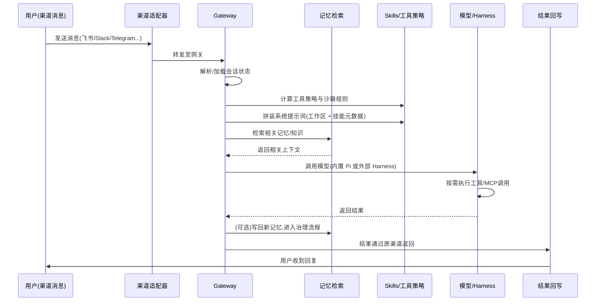
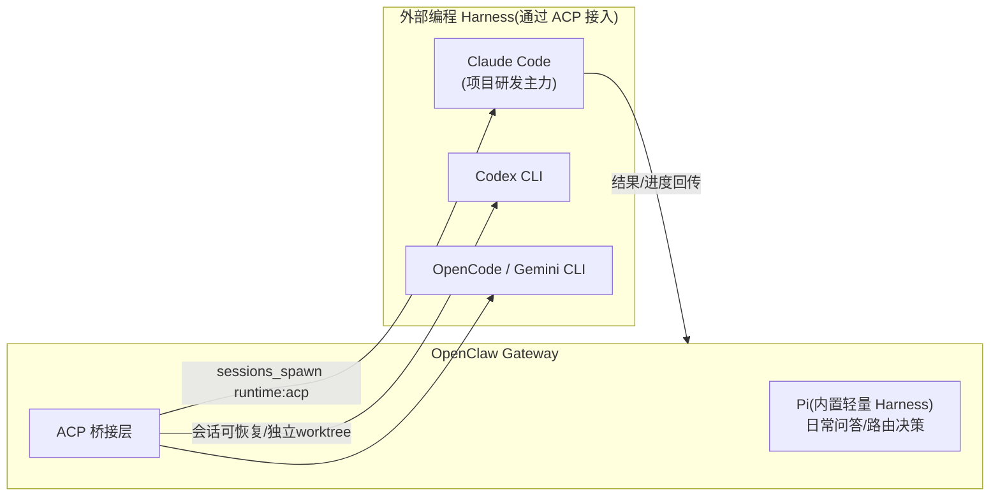
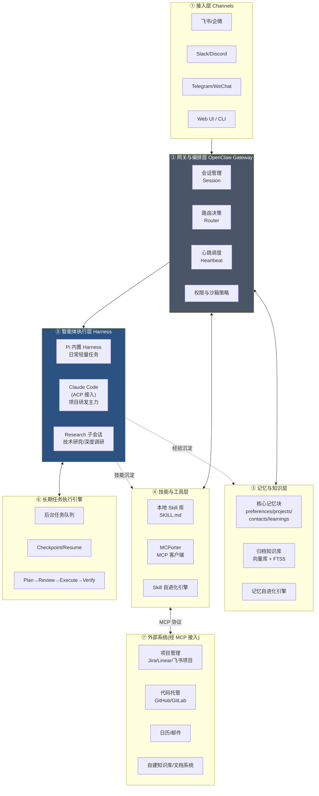
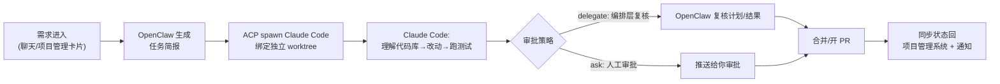
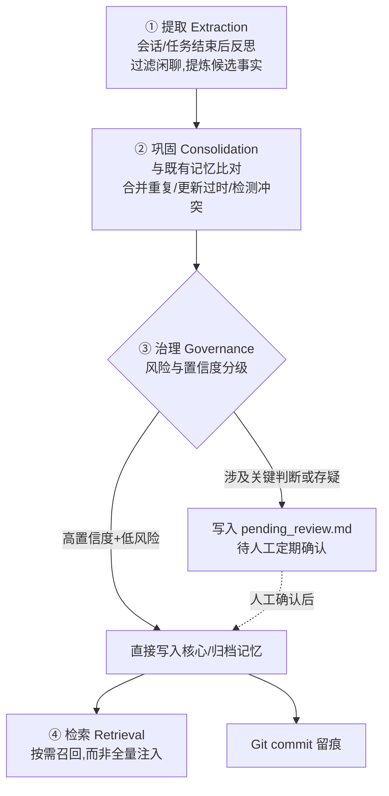
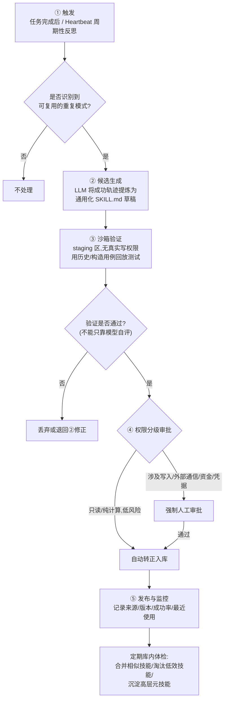
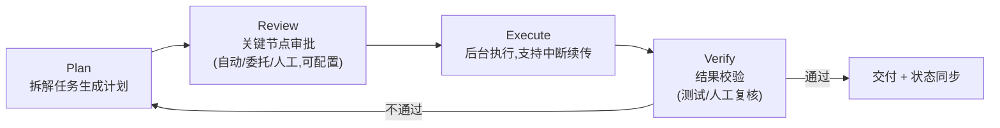
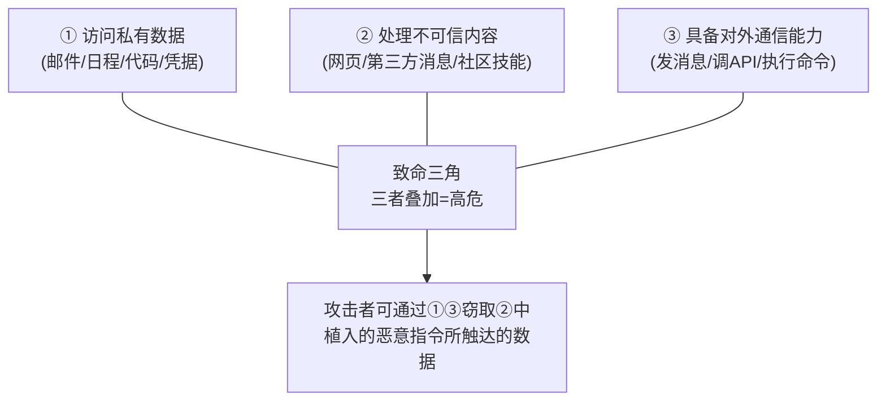
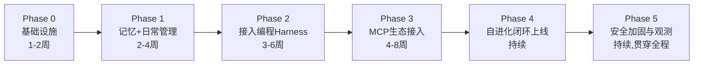

# OpenClaw + Harness 智能工作管理系统架构方案

> 版本:v1.0 | 撰写日期:2026-07-01
> 说明:本方案基于对 OpenClaw 开源生态(官方文档、GitHub 仓库、第三方插件)、Agent Harness/ACP 协议、MCP 生态、以及"自进化记忆/技能库"学术研究(Voyager、SAGE、SEAgent、Mem0、Letta/MemGPT 等)的调研整理而成。所有关键技术判断均标注了信息来源类型,供你进一步核实。

---

## 目录

0. [核心结论与关键假设澄清](#0-核心结论与关键假设澄清)
1. [需求分析与设计目标](#1-需求分析与设计目标)
2. [技术底座解析:OpenClaw 是什么、Harness 是什么](#2-技术底座解析openclaw-是什么harness-是什么)
3. [总体架构设计](#3-总体架构设计)
4. [核心子系统详细设计](#4-核心子系统详细设计)
5. [业务功能模块映射](#5-业务功能模块映射)
6. [数据与目录结构设计](#6-数据与目录结构设计)
7. [安全与风险控制(重要)](#7-安全与风险控制重要)
8. [实施路线图](#8-实施路线图)
9. [技术栈清单与成本考量](#9-技术栈清单与成本考量)
10. [参考资料](#10-参考资料)

---

## 0. 核心结论与关键假设澄清

在深入方案之前,先澄清几个决定整个架构走向的关键判断,这些是调研后得出的结论,而非行业公认的标准定义,请你先确认是否符合预期:

| 术语 | 本方案中的定义 | 依据 |
|---|---|---|
| **OpenClaw** | 一个开源(MIT 协议)、自托管的"个人 AI 助手"框架。核心是一个常驻的 **Gateway**(Node.js,JSON-RPC/WebSocket 控制平面),通过 `SOUL.md`(人设)、`AGENTS.md`(规则)、`HEARTBEAT.md`(定时任务)等 Markdown 文件定义行为,支持 40+ 消息渠道(飞书、企业微信生态的 WeChat/QQ、Slack、Telegram、Discord 等),内置 **Skills**(`SKILL.md` 技能包)、**Heartbeat**(心跳自主循环)、**MCPorter**(MCP 集成层)。它本身不是大模型,而是"模型无关"的编排壳,可接 Claude、GPT、DeepSeek、Kimi、GLM、本地 Ollama 模型等。 | 官方 GitHub 仓库 openclaw/openclaw、官方文档 docs.openclaw.ai |
| **Harness(智能体执行壳)** | 在这个生态里特指"包裹在大模型外面、让它具备手、眼、记忆和安全边界的完整基础设施"这一类工具的统称,例如 Claude Code、Codex CLI、OpenCode、Gemini CLI 都被称为"harness"。OpenClaw 自带一个内部默认 harness(代号 **Pi**),同时可以通过 **ACP(Agent Client Protocol)** 把上述外部编程类 harness 接进来,作为后台可恢复的编程会话使用。 | OpenClaw 官方文档 "Agent runtimes"、第三方项目 HKUDS/OpenHarness 对 harness 的定义 |
| **"OpenClaw + Harness" 的组合方式(本方案采用的架构假设)** | **OpenClaw 承担"常驻编排层"**(全渠道接入、心跳调度、记忆/知识库、日常事务处理、跨系统编排),**外部编程 Harness(以 Claude Code 为主力)承担"项目研发执行层"**(理解代码库、多文件修改、跑测试、开 PR)。两者通过 OpenClaw 官方支持的 **ACP** 协议桥接,这是 OpenClaw 生态里一个已经存在、有文档、有社区插件(如 `openclaw-code-agent`、`claw-orchestrator`)支撑的成熟模式,不是本方案臆造的拼接。 | 综合多个信息来源交叉验证 |

> ⚠️ **请注意**:"OpenClaw"是一个近期(2025 年底出现、2026 年初爆发式增长)的开源项目,同时也**伴随着相当密集且已被多家安全机构(Snyk、微软安全团队、卡巴斯基、NSFOCUS 等)证实的安全事件**(供应链投毒、高危 CVE、默认配置暴露公网等)。这不是"这个技术选型不能用",而是**必须在架构里把安全加固作为一等公民来设计**——本方案第 7 章会详细展开,强烈建议在落地前完整阅读。
>
> 如果你所说的"OpenClaw"或"harness"另有所指(例如指代其他同名的内部项目/私有工具),请告诉我,我可以针对性调整方案;以下内容均基于上表的调研结论展开。

---

## 1. 需求分析与设计目标

### 1.1 需求拆解

你提出的系统需求可以拆解为「**4 类业务能力**」+「**5 类底层基础设施能力**」:

**业务能力层**(系统要"为你做什么"):

1. **日常工作管理**——日程、待办、消息分诊、晨报/简报
2. **项目管理**——多项目看板、里程碑、进度汇总、风险预警
3. **项目研发**——真正动手写代码、跑测试、提 PR
4. **技术研究**——技术调研、竞品/论文追踪、研究报告产出

**基础设施能力层**(系统要"如何变得越来越好用"):

5. **长期任务执行**——任务可以跑几小时到几天,断点续传,不依赖人一直盯着
6. **知识库**——沉淀结构化+非结构化知识,支持检索复用
7. **记忆系统自进化**——系统对你、对项目的理解随时间自动变准确、变丰富
8. **MCP 集成**——用标准协议接入外部工具和数据源,而不是每个都手写对接
9. **Skill 库自进化**——可复用能力(技能)能够自动沉淀、验证、入库,越用越强

### 1.2 设计原则

考虑到这套系统会长期接触你的日程、代码仓库、项目数据甚至凭据,本方案确立以下 5 条设计原则,贯穿后续所有设计决策:

1. **本地优先 / 数据主权**:核心记忆与知识库默认落地本地文件系统(Markdown + SQLite),不强制依赖云端存储;需要云端能力(如更强的语义检索)时以"可插拔的增强层"形式接入,而不是默认上传。
2. **渐进式自主权**:任何"自动化/自进化"能力都从"只建议、不执行"起步,积累验证数据后才逐步放开自动执行的范围,而不是一步到位全自动。
3. **人在回路(Human-in-the-loop)**:高风险动作(合并代码到主分支、对外发消息、涉及资金、删除数据、修改凭据)设强制审批点,不因为"是系统自己学到的规则"而豁免。
4. **可审计、可回滚**:所有配置、记忆、技能都是 Markdown/YAML 纯文本 → 天然适合用 Git 做版本管理,每一次"自进化"产生的变更都应该是一次可读的 diff,而不是黑盒更新。
5. **关注点分离、组件可替换**:编排(OpenClaw)、执行(Coding Harness)、工具接入(MCP)、知识存储(向量库/FTS)各自独立,任何一层都可以在未来被替换而不影响其他层。


---

## 2. 技术底座解析:OpenClaw 是什么、Harness 是什么

### 2.1 OpenClaw 的五个核心组件

根据官方文档,OpenClaw 的架构可以概括为"五件套":

| 组件 | 作用 | 关键文件/配置 |
|---|---|---|
| **The Gateway(网关)** | 常驻进程,统一控制平面。所有渠道、会话、配置、UI、CLI 都通过同一个 JSON-RPC/WebSocket 协议通信 | `openclaw gateway start/stop/status` |
| **The Brain(推理引擎)** | 底层大模型,OpenClaw 本身不内置模型,按需路由到 Claude / GPT / Gemini / DeepSeek / Kimi / GLM / 本地 Ollama 模型 | `openclaw.json` 中的模型路由配置 |
| **The Hands(执行环境)** | Shell 命令、浏览器自动化(CDP/Playwright)、文件操作、智能家居控制等 | 由 Skills 与内置工具提供 |
| **The Memory(记忆系统)** | "零运维本地持久化记忆":Markdown 文件 + SQLite FTS5 全文索引的两层本地存储,无云依赖 | `~/.openclaw/memory/*.md` |
| **The Heartbeat(心跳)** | 默认每 30 分钟触发一次的自主循环,是"主动而非被动"的关键机制 | `HEARTBEAT.md` |

**请求生命周期**(消息从进入到回复的完整链路,这是理解整个系统行为的关键):



### 2.2 Skills:渐进式披露的技能系统

OpenClaw 的 Skills 是一套非常值得复用的设计——**技能不是一次性塞进系统提示词的,而是作为元数据列出,模型按需"翻阅"**,这与 Anthropic 官方的 Agent Skills 标准(`SKILL.md`,YAML frontmatter + Markdown 指令)是同一套理念,因此天然具备跨生态可移植性(同一份 `SKILL.md` 理论上可以在 OpenClaw、Claude Code 等多个 Harness 之间复用)。

```yaml
---
name: weather-briefing
trigger: "weather|forecast|temperature"
tools: [web-search, chat]
---
# Weather Briefing
当被问到天气时,搜索当前天气状况,给出简明播报:温度、天况、预警信息。
```

技能可以来自三个渠道:官方/自己编写、**ClawHub**(社区技能市场,类似技能界的 npm/PyPI)、或者本方案第 4.5 节要设计的**智能体自主生成**。

### 2.3 Harness:让模型"有手有眼"的执行壳

OpenClaw 官方文档对 Harness 的定义很清晰:

> "An Agent Harness is the complete infrastructure that wraps around an LLM to make it a functional agent. The model provides intelligence; the harness provides hands, eyes, memory, and safety boundaries."
> (Harness 是包裹在大模型外面、让它成为一个可用智能体的完整基础设施;模型提供智能,Harness 提供手、眼、记忆和安全边界。)

OpenClaw 内部默认使用一个轻量 Harness(代号 **Pi**),但通过 **ACP(Agent Client Protocol)**,可以把重量级的**外部编程 Harness** 接入进来,以独立的后台会话方式运行:



**这个组合为什么合理**(而不是生造的拼接):

- OpenClaw 官方文档专门有 "ACP agents" 一节,说明 Claude Code、Codex、Cursor、OpenCode、Gemini CLI 都是官方支持的外部 Harness 接入目标;
- 已有多个社区插件(`openclaw-code-agent`、`claw-orchestrator`)专门做"用 OpenClaw 作为聊天入口,把编码任务转发给 Claude Code/Codex 跑,支持 plan→review→execute、worktree 隔离、PR 自动跟进"这件事,说明这是一个被验证过的成熟模式;
- 好处:**编排层(何时做、给谁做、做完谁审批)和执行层(具体怎么写代码)解耦**——OpenClaw 不需要重新实现一遍代码理解能力,Claude Code 也不需要关心"消息从飞书还是 Slack 来的"。

> 📌 也可以反过来用:通过 `openclaw mcp serve`,OpenClaw 能把自己暴露成一个 MCP Server,让 Claude Code / Codex **主动**读取 OpenClaw 管理的渠道会话——即两者可以双向桥接,具体选哪个方向取决于你希望"入口"设在 OpenClaw(更适合日常场景)还是设在编程 Harness(更适合以开发为中心的场景)。本方案默认"入口在 OpenClaw"。

---

## 3. 总体架构设计

### 3.1 分层架构总览



**贯穿所有层的安全与治理层**(第 7 章详细展开):权限策略、沙箱隔离、审计日志、技能签名校验、人工审批网关——这一层不是架构图里的某一个方框,而是每一层内部都要落地的约束。

### 3.2 关键设计决策说明

| 决策点 | 选择 | 理由 |
|---|---|---|
| 编排入口放在哪 | OpenClaw Gateway | 天然多渠道(飞书/IM),心跳机制适合"主动性"要求高的日常管理场景 |
| 谁负责真正写代码 | 外部 Harness(Claude Code,经 ACP 接入) | 代码库级理解、多文件编辑、测试闭环是专业编程 Harness 的强项,不重复造轮子 |
| 记忆存哪 | 本地 Markdown + SQLite FTS5(基础层)+ 可选向量库(增强层) | 数据主权优先,同时保留向后升级到更强语义检索的空间 |
| 外部工具怎么接 | 统一走 MCP(经 MCPorter) | 一次对接、多 Harness 复用;协议是 Anthropic 发起、目前 Anthropic/OpenAI/Google 等主要厂商均已支持的开放标准 |
| 长任务怎么管 | Heartbeat(周期性)+ ACP 后台会话(事件性/长耗时) | 两种任务形态分别处理:定时类用心跳,长耗时类用可恢复的后台会话 |
| 自进化要不要"全自动" | 不要,分级审批 | 见第 4.2、4.5 节与第 7 章——自动化程度与风险等级挂钩,而不是与"技术上能不能做到"挂钩 |

---

## 4. 核心子系统详细设计

### 4.1 Harness 层(智能体运行时)详细设计

**路由策略**——不同任务类型分流到不同 Harness,而不是所有任务都用同一个模型/同一套上下文跑:

| 任务特征 | 路由目标 | 原因 |
|---|---|---|
| 简单问答、日程查询、消息分诊、创建提醒 | **Pi(内置)** | 轻量、低延迟、不需要代码库上下文 |
| 需要理解/修改代码仓库的任务 | **Claude Code(ACP)** | 需要多文件级代码库理解、测试执行、git 工作流 |
| 深度技术调研、竞品分析、长文写作 | **Research 子会话**(Pi 或 Claude Code 均可,配合 web search + 代码执行工具) | 需要多轮检索+综合分析,但不一定需要写代码 |
| 定时/条件触发的巡检类任务 | **Heartbeat 触发的轻量会话** | 周期性、通常任务简单但要求"主动" |
| 耗时数小时到数天的复杂任务 | **ACP 后台会话 + 目标循环** | 需要断点续传、独立工作区、进度回报 |

**项目研发的典型执行流程**(以"实现一个需求"为例):



关键能力(均为 OpenClaw ACP 机制原生支持,非自建):**会话可恢复**(重启/换设备不丢进度)、**独立 worktree 隔离**(多任务并行不冲突)、**分级审批**(直接执行 / 委托编排层复核 / 人工审批 / 自动开 PR 由你选择默认策略)。

### 4.2 记忆系统与自进化机制

#### 4.2.1 基础层:直接复用 OpenClaw 原生方案

不建议一上来就自建复杂的记忆中间件——OpenClaw 原生的方案已经覆盖了个人/小团队场景的大部分需求,且足够透明:

- **核心记忆块**(始终注入系统提示词,类似 Letta/MemGPT 的 "core memory"):`preferences.md`(工作习惯)、`contacts.md`(人物关系)、`projects.md`(项目上下文摘要)、`learnings.md`(经验沉淀)
- **归档记忆**(按需检索,不常驻上下文):SQLite FTS5 全文索引覆盖的历史对话/长文档
- 优点:人类可读可编辑、零额外基础设施、天然适合 Git 版本化

#### 4.2.2 增强层(按需接入,规模变大后再考虑)

当知识规模、跨项目关联复杂度上升后,可以通过 **MCP** 接入更强的记忆中间件(如支持语义检索、知识图谱关联的记忆服务),或自建向量库,作为归档记忆层的"加强版",而不是推倒重来。

#### 4.2.3 记忆自进化闭环(核心设计)

这是回应你"记忆系统自进化"需求的核心机制,基于当前学术界对 Agentic Memory 的共识(提取→巩固→治理→检索四阶段)设计:



> ⚠️ **必须正视的风险**:与静态知识库不同,"可自我编辑的记忆"存在**错误累积/漂移**的风险——一次误判被写入记忆后,可能在后续任务中被当作既定事实反复引用、层层放大(这是近期学术界"Governing Evolving Memory"方向重点研究的问题)。缓解手段:
> 1. 所有记忆文件纳入 Git,每次自动写入都是一次可读 diff,可随时回滚;
> 2. 高风险类记忆(会影响自动执行动作的规则、对人的判断)强制进入 `pending_review.md` 缓冲区,而不是直接生效;
> 3. 定期(如每周)做一次记忆健康检查:抽样复核最近写入、检测明显冲突。

### 4.3 知识库系统

**定位区分**:记忆系统关注"系统对你/项目的理解"(偏个性化、结构化摘要);知识库关注"沉淀的外部文档/研究成果"(偏非结构化、体量大、需要语义检索)。

**摄取管线**:

```
原始来源(PDF/网页/会议纪要/代码仓库README/研究报告)
    → 切块(chunking)
    → 向量化(embedding)
    → 双写:向量库(语义检索)+ FTS 索引(关键词检索)
    → 混合检索(hybrid search)供各 Harness 调用
```

**架构建议:把知识库做成一个 MCP Server**,而不是让每个 Harness 各自维护一份索引——这样 Pi、Claude Code、未来接入的任何新 Harness 都能共享同一个知识库,符合 MCP"一次对接、多方复用"的设计初衷,也避免"Claude Code 知道的东西,Pi 不知道"这种割裂。

**更新机制**:定期/事件触发(如新文档上传、代码仓库 README 变更)重新索引;过时文档做**版本标记**而非直接删除,保留可追溯性。

### 4.4 MCP 集成层

**MCP(Model Context Protocol)** 是 Anthropic 发起、目前已被 Anthropic、OpenAI、Google 等主要厂商采纳的开放协议,用于标准化"智能体如何发现和调用外部工具/数据源"。OpenClaw 通过内置组件 **MCPorter** 承担 MCP 客户端角色。

**典型接入分类**(按你的四大业务场景归类):

| 类别 | 典型 MCP Server | 服务于 |
|---|---|---|
| 项目管理类 | Jira / Linear / 飞书项目 / Notion | 项目管理模块 |
| 开发协作类 | GitHub / GitLab / Sentry | 项目研发模块 |
| 知识与文档类 | 自建知识库 MCP Server、Google Drive、Confluence | 知识库/技术研究模块 |
| 日常事务类 | 日历、邮箱、IM | 日常工作管理模块 |
| 通用能力类 | Web Search、浏览器自动化 | 技术研究、日常查询 |

**双向桥接能力**:OpenClaw 既可以作为 **MCP 客户端**去消费上述外部工具,也可以通过 `openclaw mcp serve` 把自己**作为 MCP Server** 暴露出去,让 Claude Code / Codex 等外部 Harness 直接读取 OpenClaw 管理的渠道会话与上下文。这个双向能力是本方案里"知识库/记忆能被所有 Harness 共享"的技术基础。

**安全配置要点**(结合 MCPorter 的实际配置能力):

- 优先使用本地 stdio 子进程形式的 MCP Server(天然网络隔离,只通过 stdin/stdout 通信),而非无必要地暴露远程 HTTP 端点;
- 对暴露敏感数据的 MCP Server(如数据库),显式配置边界:禁止访问的表/字段、单次查询最大返回行数、超时时间;
- API Key 等凭据一律走环境变量,不写入配置文件明文;
- 只接入确有必要的 MCP Server——同时挂载的 Server 越多,延迟和误触发概率越高。

### 4.5 Skill 库与自进化机制

这是整个方案里"自我进化"色彩最强、也是**风险管控最需要重视**的一环。设计参考了 Voyager(自动技能库鼻祖)及后续学术工作(SAGE、SEAgent、SoK: Agentic Skills 等)总结出的通用模式,并结合 OpenClaw/ClawHub 生态已经暴露过的真实安全事件做了针对性加固。

#### 4.5.1 技能格式与来源

统一采用 `SKILL.md` 格式(YAML frontmatter + Markdown 指令),与 OpenClaw 原生格式、Anthropic Agent Skills 标准、ClawHub 生态兼容,具备跨 Harness 复用的可能性。三种来源:

1. **人工编写**——你或团队直接写的固定流程(如"周报生成规范")
2. **社区安装**——从 ClawHub 等技能市场安装(⚠️ 见 4.5.3 安全前提)
3. **智能体自主生成**——系统从自己的执行轨迹中提炼出新技能(本节核心)

#### 4.5.2 自进化闭环设计



**关键设计要点**:

- **验证不能只靠"模型自己说管用"**:学术界已经指出,单纯让模型自我评估"这个技能有没有生效"不足以保证正确性,必须有客观验证手段(如针对历史真实用例回放、检查产出是否符合预期结构/结果)。
- **权限与风险分级挂钩,而非与"是否自动生成"挂钩**:一个自动生成的只读查询类技能可以较快转正;一个自动生成但涉及"自动发送外部消息"或"自动提交代码"的技能,无论生成过程多智能,都必须过人工审批这一关。
- **定期体检机制**:借鉴"元技能(meta-skill)"的思路——当某几个具体技能被高频组合使用时,可以把这个组合本身提炼成一个更高层的技能,减少重复调用链路。

#### 4.5.3 安全前提:ClawHub 生态的真实教训(必须纳入设计)

调研中发现,ClawHub(OpenClaw 官方技能市场)已经出现过被多家安全机构证实的**规模化供应链投毒事件**(详见第 7 章),核心结论可以概括为:

> Agent Skill 运行时拥有和宿主智能体**完全相同的权限**,不像传统软件包那样有沙箱隔离——这意味着安装一个恶意/存在漏洞的技能,风险等同于直接把对应权限交给了未知第三方代码。

因此,对本方案中的技能库,无论技能来自社区还是"自己生成",都遵循同一条底线:

1. 第三方技能安装前必须经过恶意软件扫描(如 VirusTotal 类工具)与来源信誉检查;
2. **自主生成的技能不因"是系统自己写的"而被默认信任**——同样要经过 4.5.2 的沙箱验证与权限分级审批;
3. 引入类似 ClawSec(社区安全技能套件)的持续监控:校验和(checksum)完整性校验、配置漂移检测(drift detection)。

### 4.6 长期任务执行引擎

**两种任务形态,两套机制**:

| 任务形态 | 承载机制 | 特点 |
|---|---|---|
| 定时/条件触发(如"每天8点晨报"、"每小时查一次CI状态") | **Heartbeat**(`HEARTBEAT.md` 定义,默认 30 分钟周期) | 轻量、周期性、单次执行时间短 |
| 耗时数小时到数天的复杂任务(如"重构某模块"、"完成一份行业调研报告") | **ACP 后台会话** + 目标循环 | 需要断点续传、独立工作区隔离、进度回报 |

**长任务的管理接口**(可直接采纳 OpenClaw 社区插件已验证的模式):`/goal`(创建目标)、`/goal_status`(查看进度)、`/goal_edit`(调整目标)、`/goal_stop`(终止)——把"长任务"当作一个有生命周期、可被查询和干预的一等公民,而不是发出去就失联的黑盒。

**执行范式:计划→审批→执行→复核(Plan → Review → Execute → Verify)**



技术支撑均为 OpenClaw ACP 机制原生能力:会话可在 Gateway 重启后**存活并恢复**(`resumeSessionId` + `session/load`),独立**工作区/worktree** 隔离避免多任务互相干扰,进度可通过原渠道**主动推送通知**。

---

## 5. 业务功能模块映射

本章把前面的技术组件对应到你提出的四类具体业务场景,给出典型工作流。

### 5.1 日常工作管理

**典型场景**:晨间简报(日程 + 未读消息汇总 + 今日优先级建议,由 Heartbeat 在固定时间触发)、邮件/IM 分诊与草拟回复、待办事项管理、会议纪要整理与行动项提取。

**涉及组件**:Pi(内置 Harness,主要承载)+ 日历/邮件/IM 类 MCP Server + `preferences.md`(记录你的工作习惯,如"上午专注写作勿扰"、"周报固定周五下午写")。

**示例心跳任务**(`HEARTBEAT.md` 片段):

```markdown
## 每日晨报(工作日 08:00)
1. 汇总昨晚至今的未读消息,按紧急程度分类
2. 拉取今日日程,标注冲突/待确认事项
3. 结合 projects.md,列出今日建议优先处理的 3 件事
4. 通过默认渠道推送简报
```

### 5.2 项目管理

**典型场景**:多项目看板同步(从飞书项目/Jira/Linear 拉取状态做组合级/Portfolio 级汇总)、里程碑跟踪与风险预警、周报/月报自动生成、跨项目资源冲突提醒。

**涉及组件**:Pi 做跨系统编排 + 项目管理类 MCP Server(双向读写状态)+ `projects.md` 记忆块(维护各项目的当前状态摘要、关键决策)+ 知识库(存历史会议纪要/决策记录供追溯)。

**示例工作流**:Heartbeat 周期性拉取各项目管理工具的最新状态 → 与 `projects.md` 中记录的上次状态比对 → 识别出"里程碑逾期"、"负责人变更未同步"等异常 → 生成风险简报推送 → 关键变化写回 `projects.md`(经 4.2.3 的治理流程)。

### 5.3 项目研发

**典型场景**:从需求(可能来自项目管理系统里的一张卡片)到代码实现的完整闭环。

**工作流**(复用 4.1 节流程图):OpenClaw 接需求 → 生成任务简报 → 通过 ACP 拉起 Claude Code 在独立 worktree 中工作 → 理解代码库、修改、跑测试 → 按预设审批策略(自动执行 / 委托 OpenClaw 复核 / 人工审批 / 自动开 PR)提交结果 → 状态同步回项目管理系统 + 通知负责人。

**涉及组件**:Claude Code(经 ACP 接入)为执行主力 + GitHub/GitLab MCP Server + Skill 库(把项目特定的开发规范、常见 bug 修复模式沉淀为技能,供后续任务直接复用,减少重复"教"模型同样的规范)。

### 5.4 技术研究

**典型场景**:定期技术雷达扫描(如每周自动检索关注领域的新论文/开源项目/竞品动态,生成简报存入知识库)、按需深度调研(提出问题 → 多轮网络搜索 + 文档阅读 + 综合分析产出研究报告)、内部方法论沉淀。

**涉及组件**:Pi 或专门的 Research 子会话(带 Web Search、代码执行等工具)+ 知识库(RAG 存储研究成果,支持后续检索复用而不是"读完就忘")+ Skill 自进化(把反复用到的分析框架、信息源筛选标准固化为技能)。

**示例心跳任务**:

```markdown
## 每周技术雷达(周一 09:00)
1. 按 learnings.md 中记录的关注领域,检索过去7天的新进展
2. 结合知识库中已有内容,过滤重复/已知信息
3. 生成结构化简报(新增论文/项目/值得关注的动态),存入 knowledge-base/digests/
4. 推送摘要,附知识库链接供深入阅读
```

---

## 6. 数据与目录结构设计

以下目录结构在 OpenClaw 原生结构基础上扩展,新增 `knowledge-base/`、技能 staging 区、记忆治理缓冲区、多项目工作区隔离等本方案特有设计:

```text
~/.openclaw/
├── openclaw.json                   # 全局配置:模型路由、渠道、权限策略
├── AGENTS.md                       # 全局规则/操作手册(注入所有 session)
├── SOUL.md                         # 助手人设与行为边界
├── TOOLS.md                        # 工具清单与使用说明
├── HEARTBEAT.md                    # 心跳任务定义(晨报/周报/巡检类)
│
├── memory/                         # 记忆系统(第4.2节)
│   ├── preferences.md              # 个人/团队工作偏好(核心记忆块)
│   ├── contacts.md                 # 人物与角色关系(核心记忆块)
│   ├── projects.md                 # 项目上下文与状态摘要(核心记忆块)
│   ├── learnings.md                # 经验教训与最佳实践沉淀(核心记忆块)
│   ├── pending_review.md           # 待人工确认的候选记忆(治理缓冲区)
│   └── archive.db                  # SQLite FTS5 全文索引(归档记忆)
│
├── knowledge-base/                 # 知识库(第4.3节)
│   ├── docs/                       # 摄取的原始文档
│   ├── index/                      # 向量库 + FTS 索引
│   └── digests/                    # 定期生成的知识摘要/简报归档
│
├── workspace/
│   └── skills/                     # Skill 库(第4.5节)
│       ├── <skill-name>/SKILL.md   # 已发布的本地/自生成技能
│       └── _staging/               # 待验证的候选技能(沙箱区)
│
├── config/
│   └── mcporter.json               # MCP 服务器注册(第4.4节)
│
└── projects/                       # 项目研发工作区(第5.3节)
    └── <project-slug>/             # 各项目独立 git worktree 挂载点
```

**设计要点**:`memory/` 与 `knowledge-base/` 分离,对应第 4.2/4.3 节"个性化理解 vs 外部知识沉淀"的定位区分;`_staging/` 是 Skill 自进化流程中沙箱验证阶段的物理隔离,验证通过前不会出现在正式技能列表里;`projects/<slug>/` 保证多项目并行开发时互不干扰。

---

## 7. 安全与风险控制(重要)

> 这一章请务必完整阅读。调研过程中发现,OpenClaw 生态在 2026 年上半年已经发生过**多起被主流安全机构证实的真实安全事件**,规模不小,且部分风险是这类"高权限、全渠道接入、支持第三方扩展"的智能体系统在架构上就容易出现的通病,不会因为换个名字就自动消失。把这些风险摆在明面上,是为了让你在真正投入部署前做出知情决策,而不是想吓退你。

### 7.1 已被证实的真实安全事件(截至调研时点)

| 事件 | 概要 | 信息来源类型 |
|---|---|---|
| **CVE-2026-25253**(CVSS 8.8) | 一处"跨权限边界资源传递不当"(CWE-669)漏洞,已于 2026 年 1 月 30 日发布的 2026.1.29 版本修复 | 安全研究团队披露 + 官方修复记录 |
| **"ClawHavoc" 供应链投毒事件** | 单个 ClawHub 账号自动化上传 300+ 个恶意技能包;后续跟进扫描发现全生态(约 1 万余个技能)中**已确认恶意技能超过 800 个**,不同机构估算占比约 10%~20% | 多家独立安全公司交叉证实(Koi Security、Bitdefender 等) |
| **ToxicSkills 审计** | 对近 4000 个 ClawHub/skills.sh 技能的系统性审计,发现 **约 36% 存在可探测的提示注入(prompt injection)特征**,其中数十个是主动窃取凭据/植入后门/外传数据的确认恶意样本 | 安全厂商(Snyk)专项研究报告 |
| **默认配置暴露公网** | 早期版本默认监听 `0.0.0.0`(即对公网开放),某安全评级机构曾识别出约 13.5 万个暴露实例 | 安全评级机构扫描报告 |
| **恶意软件捆绑** | 部分恶意技能被发现捆绑 macOS 窃密木马(infostealer) | 安全厂商威胁情报 |

### 7.2 架构性风险:"致命三角"

安全研究者 Simon Willison 提出的 "lethal trifecta(致命三角)" 概念很适合用来概括这类系统的根本性风险——当一个智能体同时具备以下三种能力时,风险会指数级放大:



本方案设计的系统**恰好天然具备这三项能力**(这也是它有价值的原因)——所以风险控制不是"要不要做"的问题,而是"怎么把三角形的每条边都加固"的问题。

### 7.3 针对性加固清单

| # | 加固措施 | 对应风险 |
|---|---|---|
| 1 | **网络隔离**:Gateway 仅监听本地回环/内网,严禁绑定 `0.0.0.0`;确需远程访问用 Tailscale 等零信任方案而非公网直连 | 默认配置暴露 |
| 2 | **账号隔离**:给系统使用的邮箱/IM/代码仓库账号与个人主账号分离,权限最小化授予 | 致命三角-①私有数据范围 |
| 3 | **环境隔离**:Gateway 与各 Harness 运行在容器/受限用户权限下而非直接宿主机权限;编程 Harness 的 worktree 执行环境与生产凭据隔离 | CVE 类漏洞影响面 |
| 4 | **技能供应链管控**:第三方技能安装前强制过恶意软件扫描(VirusTotal 类)+ 来源信誉检查;只允许经审计的技能获得网络/写权限 | ClawHavoc / ToxicSkills |
| 5 | **自生成技能同等审查**:不因"系统自己写的"而豁免 4.5.2 节的沙箱验证与分级审批 | 致命三角-②不可信内容(包括模型自身可能被间接提示注入影响) |
| 6 | **记忆写入治理**:涉及外部动作的"学到的规则"不能自动提升为可自动执行,必须显式确认(见 4.2.3) | 致命三角-③外部通信 + 错误累积风险 |
| 7 | **持续完整性监控**:引入 ClawSec 一类的技能校验和/配置漂移检测工具,定期巡检 | 技能被篡改 |
| 8 | **审计与可回滚**:所有配置/记忆/技能纳入 Git,定期审查变更 diff | 全部风险的兜底手段 |
| 9 | **高风险动作强制人工审批**:合并代码到主分支、对外发送内容、涉及资金、删除数据、修改凭据 | 致命三角-③ |
| 10 | **及时更新**:关注 OpenClaw 官方安全公告(`openclaw doctor` 可检测已知问题),第一时间升级修复版本 | 已知 CVE |

> 💡 一个简单的经验法则:**这套系统不应该运行在你唯一的、装着敏感数据的主力设备上,也不应该用你的主账号登录各类服务**——用独立设备/容器 + 独立低权限账号起步,验证稳定可靠后再考虑扩大权限范围,这本身也是第 1.2 节"渐进式自主权"原则的直接体现。

---

## 8. 实施路线图

不建议一次性把全部能力上线,尤其是"自进化"相关的部分建议先跑一段观察期。以下是建议的分阶段节奏(时间为参考量级,视投入人力浮动):



| 阶段 | 目标 | 关键产出 |
|---|---|---|
| **Phase 0** 基础设施搭建 | 跑通最小可用系统 | 部署 Gateway、配置 `SOUL.md`/`AGENTS.md`、接入 1-2 个 IM 渠道、跑通基础 Heartbeat |
| **Phase 1** 记忆与日常管理打底 | 日常工作管理场景可用 | 结构化 `memory/` 目录、导入现有知识文档到知识库、跑通晨报/待办场景 |
| **Phase 2** 引入编程 Harness | 项目研发场景可用 | 配置 ACP 接入 Claude Code、在 1 个真实项目上跑通"需求→代码→PR"闭环、建立 worktree 与审批策略 |
| **Phase 3** MCP 生态接入 | 项目管理/技术研究场景可用 | 逐步接入项目管理工具、代码托管、日历邮件等 MCP Server,替换手工桥接 |
| **Phase 4** 自进化闭环上线 | 记忆/技能自动沉淀 | **先以"全人工复核"模式跑 2-4 周积累数据和信任**,再逐步放开自动转正的比例;不要一开始就全自动 |
| **Phase 5** 安全加固与观测(贯穿全程,非最后补丁) | 达成第 7 章加固清单 | 网络隔离、账号隔离、技能扫描、审计日志、定期安全巡检机制常态化 |

> 建议:Phase 5 不应理解为"最后再做安全",而应从 Phase 0 就同步落地基础项(网络隔离、账号隔离),后续阶段随功能扩展同步补齐对应的加固措施。

---

## 9. 技术栈清单与成本考量

### 9.1 分层技术栈建议

| 层级 | 推荐技术/产品 | 备选/说明 |
|---|---|---|
| 编排 Gateway | OpenClaw | 核心底座,本方案的编排层锚点 |
| 编程 Harness | Claude Code(经 ACP 接入) | 备选:Codex CLI、OpenCode、Gemini CLI,可并存以应对不同任务偏好或做交叉验证 |
| 基础记忆存储 | Markdown 文件 + SQLite FTS5(OpenClaw 原生) | 增强层可选接入语义检索/知识图谱类记忆中间件 |
| 知识库向量检索 | 主流开源向量库(自托管)或云端向量检索服务 | 依数据敏感度与预算选自托管或托管服务 |
| 工具/数据集成 | MCP(经 MCPorter)+ 官方/社区 MCP Server | 优先选用官方维护或活跃度高、经审计的社区 Server |
| 容器化与隔离 | Docker/容器化部署 Gateway 与各 Harness | 配合第 7 章的环境隔离要求 |
| 远程访问 | Tailscale 或等效零信任内网方案 | 避免公网直接暴露 |
| 版本管理 | Git(纳管 `memory/`、`workspace/skills/`、配置文件) | 支撑第 4.2/4.5 节的可审计可回滚设计 |
| 技能安全 | ClawHub 官方扫描 + VirusTotal 类工具 + ClawSec 一类完整性校验套件 | 对应第 7.3 节加固清单 |

### 9.2 成本考量要点

- **模型调用成本是长期运行系统的主要变量**:心跳周期性任务、后台长任务、自进化的反思/提炼环节都会持续消耗 Token,建议:轻量任务(路由决策、简单问答)路由到更经济的模型,复杂编码/研究类任务才调用旗舰模型;
- **Claude Code / Claude Agent SDK 等编程 Harness 的计费方式可能独立于交互式 Claude 订阅**,且随产品迭代可能调整——具体计费规则建议在实施前直接查阅 Anthropic 官方文档(`docs.claude.com`、`support.claude.com`)确认最新情况,本方案不对具体定价做承诺性描述;
- **自进化环节的隐性成本**:候选技能的沙箱验证、记忆巩固阶段的比对/去重都需要额外的模型调用,规模变大后这部分开销不可忽视,建议纳入监控。

---

## 10. 参考资料

以下为本方案调研过程中参考的主要信息来源(按类别整理,标注信息性质供你判断权重):

**OpenClaw 官方/半官方资料**
- OpenClaw 官方仓库:`github.com/openclaw/openclaw`
- OpenClaw 官方文档(架构、ACP、MCP):`docs.openclaw.ai`
- ClawHub 技能市场

**技术/架构类学术与研究文章**
- Voyager: An Open-Ended Embodied Agent with Large Language Models(自进化技能库奠基性工作)
- SoK: Agentic Skills — Beyond Tool Use in LLM Agents
- A Comprehensive Survey of Self-Evolving AI Agents
- Governing Evolving Memory in LLM Agents(SSGM 框架,记忆治理风险)
- Mem0 / Letta(MemGPT)官方技术资料

**安全研究报告(第7章依据)**
- Snyk "ToxicSkills" 专项审计报告
- 微软安全团队、卡巴斯基、NSFOCUS、Conscia 等关于 OpenClaw 安全风险的公开分析
- CVE-2026-25253 披露与修复记录

> ⚠️ **重要提醒**:OpenClaw 生态目前仍处于快速演进期(架构、命令、配置字段可能在数周内变化),且本身是一个高权限、涉及真实安全事件的系统。在正式投入生产使用前,强烈建议:(1)直接查阅 OpenClaw 官方最新文档核实本方案中的具体命令与配置字段;(2)完整阅读官方安全公告与最佳实践指南;(3)先在隔离环境中用低权限账号试运行,验证稳定后再逐步扩大范围。

---

*本文档为架构设计方案,不构成安全审计报告或生产部署保证。落地前请结合你的实际团队规模、数据敏感度、合规要求做适应性调整。*
