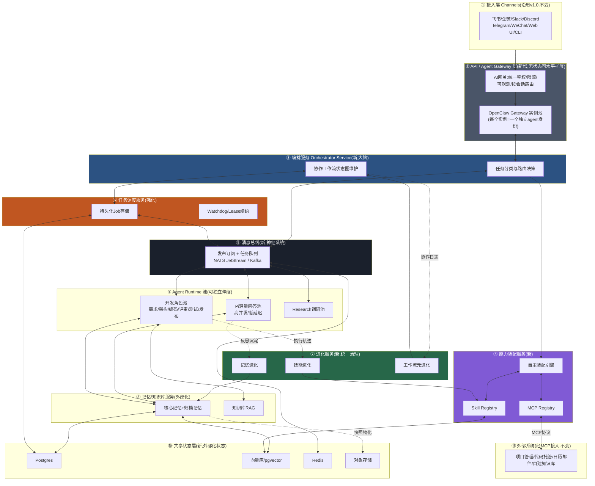
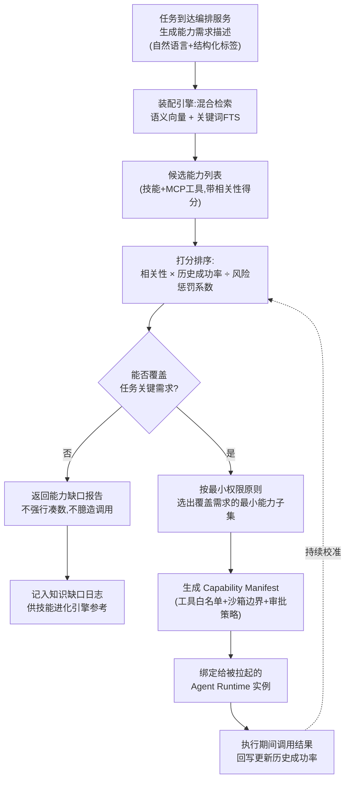
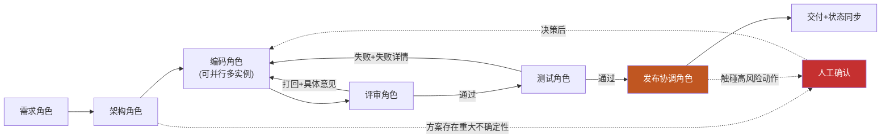
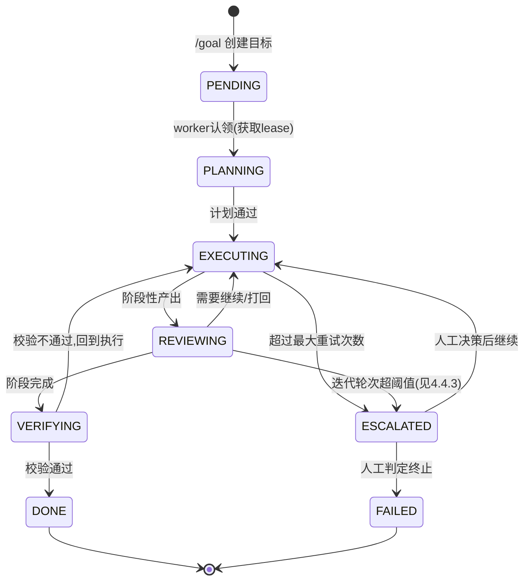
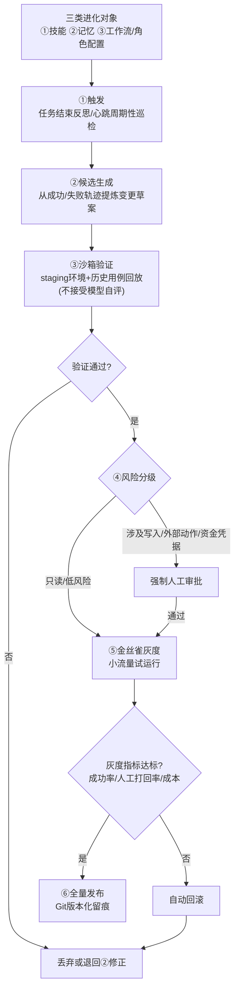
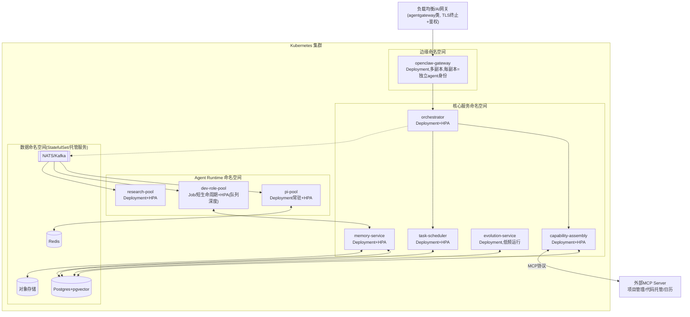
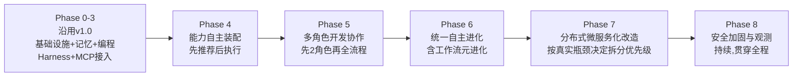

# OpenClaw + Harness 分布式多智能体系统架构方案 v2.0

## ——微服务化 / 能力自主装配 / 多角色研发协作 / 无人值守长任务 / 自主进化

> 版本:v2.0 | 承接文档:`openclaw-harness-system-design.md`(v1.0,2026-07-01)
> 说明:本方案是 v1.0 的**演进升级**,不是另起炉灶。v1.0 中仍然成立的内容(设计原则、记忆/技能基础格式、安全"致命三角"框架)本文档不重复展开,只在必要处引用;本文档新增与重写的部分聚焦你提出的 5 点新需求:分布式微服务化、技能与 MCP 自主装配、开发任务多角色协作与多轮迭代、长期任务无人值守、自主进化。所有基于本轮检索得到的关键事实性判断均标注了信息来源,供你核实。

---

## 目录

0. [v2.0 版本说明与关键假设确认](#0-v20-版本说明与关键假设确认)
1. [新增需求拆解与架构落点映射](#1-新增需求拆解与架构落点映射)
2. [现实基线核查:OpenClaw 原生架构的扩展边界](#2-现实基线核查openclaw-原生架构的扩展边界)
3. [总体架构 v2.0:服务拓扑总览](#3-总体架构-v20服务拓扑总览)
4. [核心子系统详细设计](#4-核心子系统详细设计)
   - 4.1 服务间通信:同步/异步选型与服务网格
   - 4.2 Agent Runtime 池:从"进程内多会话"到"可独立伸缩的服务池"
   - 4.3 能力自主装配引擎(Skill + MCP Autonomous Assembly)
   - 4.4 多角色开发协作与多轮迭代引擎
   - 4.5 长期任务无人值守引擎(分布式版)
   - 4.6 自主进化引擎(统一治理:技能 + 记忆 + 工作流元进化)
   - 4.7 记忆与知识库服务化
5. [部署拓扑与技术栈 v2.0](#5-部署拓扑与技术栈-v20)
6. [数据与状态:本地文件与共享服务状态的边界划分](#6-数据与状态本地文件与共享服务状态的边界划分)
7. [安全与风险控制 v2.0 增量](#7-安全与风险控制-v20-增量)
8. [实施路线图 v2.0](#8-实施路线图-v20)
9. [关键取舍与已知限制(请务必读完再动工)](#9-关键取舍与已知限制请务必读完再动工)
10. [参考资料(v2.0 新增)](#10-参考资料v20-新增)

---

## 0. v2.0 版本说明与关键假设确认

在展开设计前,先明确几个决定架构走向的判断——和 v1.0 的写法一致,这些是调研后的结论或我的设计判断,不是行业公认定义,请先确认是否符合你的预期:

| # | 判断 | 性质 |
|---|---|---|
| 1 | 本文档把你的 5 点要求理解为**对 v1.0 架构的演进升级**,继续以 OpenClaw 的 Gateway / Skills / MCPorter / ACP / SubAgent / Heartbeat 为能力构件基础。如果你其实想脱离 OpenClaw 生态、完全自建一套分布式多智能体平台,以下设计的分层思路仍可复用,但"直接复用 OpenClaw 原生构件"的部分需要替换为自建组件,请告诉我。 | 假设,待确认 |
| 2 | "分布式微服务"按行业通行定义设计:**可独立部署、可独立伸缩、通过网络 API / 消息总线通信的服务集合**。第 2 章会给出本轮检索确认的关键事实——OpenClaw 原生 Gateway 目前是**单网关有状态中枢**,官方与社区的横向扩展方式是"部署更多相互独立的智能体",而非"给同一个智能体做多副本"。这是**检索确认的现状**,不是我的设计假设,直接决定了微服务化要怎么做。 | 事实性判断,有来源 |
| 3 | "多角色开发协作"默认基于 OpenClaw 已具备的 **SubAgent(子智能体生成与会话隔离)** 原生能力搭建,而非引入 AutoGen / CrewAI / LangGraph 等外部多智能体框架——这样可以复用 v1.0 已经设计好的 ACP / worktree 隔离 / 分级审批基础设施。若你更倾向独立于 OpenClaw 的外部编排框架,可以,但取舍不同,见第 9 章。 | 设计选择 |
| 4 | 默认这套系统的使用规模仍是**个人 / 小团队**,微服务化的目的是获得**故障隔离、热点环节(如编码类任务)独立伸缩、支持多项目并发**这些收益,而不是服务海量用户。如果你的真实目标是团队 / 企业级规模,部署拓扑与安全模型需要相应加强,第 9 章会标注具体差异点。 | 假设,待确认 |
| 5 | OpenClaw 近期发展迅速:2025 年 11 月以 Clawdbot 之名首发,2026 年 1 月经商标纠纷更名 Moltbot,同月 29 日更名为现在的 OpenClaw,数月内星标数从数千冲到十余万[来源见§10]。这意味着具体命令、配置字段、内部模块名可能在你实施时已经变化,本文档给出的是**架构层面的设计**,具体 API/命令请以你安装版本的官方文档为准。 | 事实性判断,有来源 |

---

## 1. 新增需求拆解与架构落点映射

你提出的 5 点要求,拆解后对应到架构里的具体落点:

| 你的原话 | 拆解后的能力需求 | 本文档对应章节 |
|---|---|---|
| 分布式微服务 agent | 把系统从"单 Gateway 进程"拆解为可独立部署/伸缩/替换的服务集合,服务间通过 API + 消息总线通信,状态外部化到共享存储 | §2、§3、§5 |
| 技能、MCP 自主装配 | 系统能根据任务自动检索、打分、挑选、绑定所需的 Skill 与 MCP 工具,而不依赖人工预先配置好固定工具集 | §4.3 |
| 开发任务多角色协作、多轮迭代 | 需求/架构/编码/评审/测试/发布等角色作为独立智能体协作,支持评审打回、测试失败重做等反馈环,并有迭代熔断机制防止无限空转 | §4.4 |
| 长期任务无人值守 | 任务可持续运行数小时到数天,状态持久化、可断点续传、有看门狗机制侦测卡死并自动重试或升级人工,而不依赖人一直盯着 | §4.5 |
| 自主进化 | 不只是技能库和记忆自动沉淀,连"多角色协作流程本身"也能被观察、提炼、验证、灰度上线——三类进化对象统一到一套治理框架下 | §4.6 |

v1.0 中的其余能力(日常工作管理、项目管理、知识库摄取管线、Skill/记忆的基础格式与四阶段闭环、"致命三角"安全框架、渐进式自主权等 5 条设计原则)在 v2.0 中**保持不变**,不重复展开,均可参照原文档对应章节;本文档只在被微服务化直接影响到的地方做增量说明。

---

## 2. 现实基线核查:OpenClaw 原生架构的扩展边界

这一章必须放在设计之前读,否则后面的服务拆分会建立在错误的假设上。

### 2.1 OpenClaw 官方的水平扩展模型是什么

综合本轮检索到的官方文档与多篇生产环境实践文章,可以概括为以下几点确认过的事实:

- OpenClaw 官方 Kubernetes 部署脚本(`docs.openclaw.ai/install/kubernetes`)给出的是**单 Pod 模式**:一个 `Deployment`(单副本,init container + gateway)、一个 `ClusterIP Service`、一个 `PersistentVolumeClaim`,不包含任何集群态(cluster-scoped)资源[官方文档]。
- 网关进程本身是有状态的:会话、cron/jobs 状态、内存中的运行时数据都不会在多副本间自动复制,社区实践的结论是单一主节点、不支持同一智能体的多副本并行运行[社区实践文章]。
- 横向扩展的推荐方式不是给同一个智能体加副本,而是部署更多相互独立、各自拥有独立配置和内存目录的智能体(更多 Deployment),用负载均衡或渠道路由把不同任务分流给不同智能体[社区实践文章]。
- 如果确实需要多副本 + 共享状态(例如团队共用一份记忆),需要引入 `ReadWriteMany` 共享卷(NFS / CephFS / Longhorn 等),并自行处理并发写冲突(文件锁或按 agent 分区),这不是开箱即用的能力[社区实践文章,LumaDock]。

同时也能看到 OpenClaw 生态里已经有更接近"真微服务"的实践方向:社区文章描述过用 Nginx/HAProxy 做负载均衡、多台机器上跑多个 Gateway/Agent 节点、再把 PostgreSQL、Redis、文件存储这类真正需要共享的状态收敛成独立的后端服务这一模式[DEV Community 实践文章],这与云厂商把"agent 系统"拆分为"推理、工具执行、记忆检索"等独立微服务的通用思路是一致的[阿里云社区技术文章]——但这属于**在 OpenClaw 之外新建的基础设施**,不是 OpenClaw 内置能力。

### 2.2 这对本方案意味着什么

**关键结论**:v2.0 的"分布式微服务化"不能理解成"把 OpenClaw Gateway 这个进程变成可无限水平复制的无状态服务"——目前的证据表明这在 OpenClaw 原生架构下做不到,勉强做(比如用 RWX 卷让多个 Gateway 副本共享同一份本地文件状态)反而会引入并发写冲突等新问题。

正确的做法是:**保留 OpenClaw 的能力构件(Skills / MCPorter / ACP / SubAgent / Heartbeat)作为"计算单元"的实现基础,把原本塞在 Gateway 进程内、依赖本地文件的状态(会话、记忆、任务队列、技能目录)搬到外部共享服务中,再围绕这些共享状态设计一层新的编排、装配、调度、进化服务**——即第 3 章要画的架构。换句话说:不是让 Gateway 自己变成集群,而是让 Gateway(及其变体实例)退化为这套分布式系统里"众多可替换计算单元之一",而不再是唯一的状态持有者。

### 2.3 一个真实存在、可以直接复用的地基:SubAgent 原生能力

调研中确认了一个对第 4.4 节(多角色协作)非常关键的事实:OpenClaw **已经原生具备子智能体(SubAgent)生成与会话隔离机制**——包括子智能体生成(`subagent-spawn`)、智能体间消息传递(`sessions_send` / mailbox 异步收件箱)、独立的会话上下文与内存、继承父智能体的技能访问权限但状态相互隔离、以及 `plan` / `delegate` / `acceptEdits` 等权限模式[社区技术编译文章、GitHub 官方仓库讨论区]。据社区文章描述,这套机制在 2026 年初的版本迭代中被强化为"确定性子智能体生成 + 结构化智能体间通信"[第三方技术文章,非官方一手确认],官方仓库讨论区也能看到围绕"Agent Teams"(团队级配置、命名空间化的 Agent ID、基于文件的 Mailbox)展开的功能提案,列出的底层原语(子智能体生成、智能体间通信、会话路由、插件架构)已经确认存在[GitHub openclaw/openclaw discussions]。

> ⚠️ 需要澄清的地方:"SubAgent"这一层底层机制(生成、隔离、消息传递)证据比较扎实;但"Agent Teams"作为一个完整产品化功能(`TeamCreateTool`、团队配置文件约定等)在不同资料里的成熟度描述不完全一致,看起来仍处于快速演进阶段。**建议在正式依赖具体工具名 / 配置字段前,以你实际安装版本的官方文档做二次确认**,本方案第 4.4 节按"基于已确认的 SubAgent 原语自建协作层"来设计,即使具体的 Team 高层封装 API 有出入,底层原语足够支撑本方案的设计。

---

## 3. 总体架构 v2.0:服务拓扑总览

**贯穿所有层的安全治理层**(第 7 章展开):服务身份与 mTLS、消息总线访问控制、统一审计与追踪——这一层不是图里的某个方框,而是每条连线都要满足的约束。

### 3.1 各层职责与"相对 v1.0 的变化"一览

| 层 | 职责 | 相对 v1.0 的变化 |
|---|---|---|
| ① 接入层 | 多渠道消息收发 | 不变 |
| ② API/Agent Gateway 层 | 统一入口、鉴权限流、把 OpenClaw Gateway 降级为"众多可替换计算单元之一" | **新增**——v1.0 里 Gateway 是唯一中枢,v2.0 里它是被前置网关管理的一组实例 |
| ③ 编排服务 | 任务分类路由、维护协作工作流状态 | **新增**——v1.0 这部分逻辑隐含在 Gateway 内部,现在独立成服务,状态外部化 |
| ④ Agent Runtime 池 | 实际执行推理与工具调用 | v1.0 是"内置Pi + ACP拉起外部Harness",v2.0 把每类角色做成独立可伸缩的服务池 |
| ⑤ 能力装配服务 | 技能与MCP工具的自动检索、打分、装配 | **全新子系统**,对应需求2,详见§4.3 |
| ⑥ 任务调度服务 | 长期任务生命周期管理 | v1.0 已有雏形(Heartbeat+ACP后台会话),v2.0 独立成服务并外部化状态,详见§4.5 |
| ⑦ 进化服务 | 技能/记忆/工作流的自动进化 | v1.0 记忆进化(§4.2.3)与技能进化(§4.5.2)是两条平行逻辑,v2.0 统一到一个服务,新增工作流元进化,详见§4.6 |
| ⑧ 记忆/知识库服务 | 个性化理解与外部知识沉淀 | v1.0 是本地文件,v2.0 服务化+外部共享存储,双写保留可读可审计特性,详见§4.7 |
| ⑨ 消息总线 | 服务间异步通信骨干 | **新增**——替代/桥接原本进程内的 mailbox |
| ⑩ 共享状态层 | 承载所有需要跨服务共享的状态 | **新增**——原本分散在各处的本地文件被收敛到这里 |
| ⑪ 外部系统 | 经MCP接入的第三方系统 | 不变 |

### 3.2 关键设计决策(v2.0 新增/调整部分)

| 决策点 | 选择 | 理由 |
|---|---|---|
| Gateway 要不要拆? | 不强行拆解 Gateway 进程本身,而是在其前面加一层无状态 API/Agent 网关,后面部署多个相互独立的 Gateway 实例 | 呼应第2章的现实基线核查:Gateway 进程有状态、不支持同一智能体多副本,硬拆会遇到官方架构没有解决的并发写冲突问题 |
| 服务间怎么通信 | 请求-响应用同步 API(gRPC/REST),协作消息、任务事件用异步消息总线 | 见4.1,同步调用适合"要立即拿到结果"的场景,异步适合"多角色协作"和"长任务"这类天然异步的场景 |
| 状态放哪 | 原来的本地 Markdown/SQLite/jobs.json 迁移为 Postgres+pgvector 为主,Markdown 仅作为可读可审计的物化视图保留 | 见§4.7、§6,分布式场景下多个服务/实例需要读到同一份权威状态 |
| 多角色协作基于什么原语 | 复用 OpenClaw 原生 SubAgent 机制,而非引入外部多智能体框架 | 见§2.3、§4.4,降低重复造轮子的成本,同时复用 v1.0 已设计的 ACP/worktree/审批基础设施 |
| 装配算法要不要"全自动执行" | 不要,遵循 v1.0"渐进式自主权"原则,先推荐后执行 | 见§4.3、§8,与技能/记忆自进化的分级审批逻辑保持一致 |

---

## 4. 核心子系统详细设计

### 4.1 服务间通信:同步/异步选型与服务网格

分布式化后最容易出问题的不是"某个服务写得好不好",而是服务之间怎么打交道。本方案定两条简单规则:

**规则一:需要立即拿到结果的调用用同步 API,天然异步/一对多/需要重试的用消息总线。**

| 通信场景 | 方式 | 示例 |
|---|---|---|
| Gateway 转发消息给编排服务并等待路由结果 | 同步 gRPC/REST | "这条消息该交给哪个 agent 处理" |
| 编排服务向能力装配服务查询候选工具 | 同步 gRPC/REST | "这个任务需要哪些技能/MCP工具" |
| 编排服务下发任务给 Agent Runtime 池 | 异步(消息总线,任务队列语义) | Agent 池水平扩展、多个实例竞争消费同一批任务 |
| 多角色智能体之间传递协作消息(评审意见、测试报告) | 异步(消息总线,替代原生 mailbox) | 编码角色不需要评审角色实时在线 |
| 任务调度服务的 Watchdog 巡检、进化服务的周期性反思 | 异步(事件订阅) | 心跳/巡检类天然是"定期发生"而非"等待响应" |
| Agent 执行结果回写记忆/知识库服务 | 异步(消息总线) + 幂等写入 | 允许延迟,避免主流程被记忆写入拖慢 |

**规则二:服务发现与身份不依赖硬编码地址。** 每个服务注册到统一的服务发现机制(K8s Service/DNS 即可满足大部分场景,规模更大时可引入 Consul/etcd),调用方按服务名而非 IP 寻址;服务间调用一律走 mTLS(见§7),不存在"内网默认互信"这件事——这一点直接呼应 v1.0"人在回路"和"最小权限"原则在分布式场景下的自然延伸。

**服务网格是可选项,不是必选项。** 如果团队本身没有服务网格(Istio/Linkerd)运维经验,规模不大时用轻量方案也可以满足 mTLS+可观测的核心诉求(比如 SPIFFE/SPIRE 做工作负载身份 + 应用层直接做 gRPC TLS),不必为了"看起来更完整"引入 Istio 的运维负担——这一点在§9会再次强调。

### 4.2 Agent Runtime 池:从"进程内多会话"到"可独立伸缩的服务池"

v1.0 里"Harness 层"是 OpenClaw 进程内的 Pi + 通过 ACP 拉起的外部 Harness 会话。v2.0 把这一层拆成三个可独立伸缩的服务池,伸缩策略完全不同,不应该用同一套部署参数管理:

| Agent 池 | 承载任务 | 资源特征 | 伸缩策略 | 部署形态 |
|---|---|---|---|---|
| **Pi 轻量问答池** | 简单问答、日程查询、消息分诊 | 低延迟、高并发、单次执行短 | 基于请求 QPS 做 HPA,常驻多副本 | Deployment,常驻 |
| **开发角色池** | 需求/架构/编码/评审/测试/发布(见§4.4) | 单次任务耗时长、资源消耗高(代码库上下文、跑测试)、有独立 worktree | 基于任务队列深度做 HPA,短生命周期,一个任务对应一个/一组实例 | Job/短生命周期 Pod,任务结束即释放 |
| **Research 调研池** | 深度调研、竞品分析、长文写作 | 中等耗时、多轮检索+综合分析 | 基于任务队列深度做 HPA | 介于常驻与 Job 之间,视任务时长选择 |

**这三个池底层怎么实现"多角色协作"和"会话隔离",直接复用 OpenClaw 已确认存在的 SubAgent 原语**(见§2.3):子智能体生成、独立会话上下文与内存、继承父级技能访问权限但状态隔离、`sessions_send`/mailbox 异步通信。v2.0 在此基础上做两点关键调整,把"单机内多 agent 协作"升级为"跨实例/跨节点可恢复的协作":

1. **协作状态外部化**:一个"协作任务"(即 v1.0 里的一个 Team/一组 SubAgent)的元数据——参与角色、当前进度、mailbox 消息记录——不再只存在某个宿主机的本地 `~/.openclaw/teams/` 目录里,而是双写到共享状态层(Postgres 存结构化状态,原生本地文件作为可读审计副本保留)。这样即使承载某个角色的 Pod 被重新调度到别的节点,协作状态依然可查、可恢复。
2. **Mailbox 语义桥接到消息总线**:智能体间的 `sessions_send` 调用在 v2.0 里通过消息总线的对应 topic 实现跨节点投递,而不要求两个角色的会话运行在同一台机器/同一个网络命名空间内——这是让"多角色协作"真正具备跨节点分布式能力的关键一步,而不仅仅是单机内的进程内异步。

**成本与模型分级**:不同角色路由到不同能力档位的模型是已经被验证过的做法——社区实践报告显示,合理的角色分工(轻量模型做路由/初筛,旗舰模型做核心推理)可以把整体 token 成本降低约三成左右[社区技术文章]。v2.0 沿用这一原则:Pi 池默认用性价比模型,开发角色池里"评审初筛""需求澄清"这类判断成本较低的角色可以用较轻量模型,"架构设计""核心编码"路由到旗舰模型。

### 4.3 能力自主装配引擎(Skill + MCP Autonomous Assembly)

这是对应你"技能、MCP 自主装配"需求的核心子系统。v1.0 里 Skill 和 MCP 是两个分开的静态配置(§4.4"典型接入分类表"+§4.5"技能三种来源"),需要人工预先决定"这个 agent 该挂哪些技能、连哪些 MCP Server"。v2.0 把这一步变成一个自动化服务:**任务来了,系统自己检索、打分、挑选、绑定所需能力,而不是把所有已接入的技能和工具都塞给每个 agent**。

这个设计模式在 MCP 生态里已经有成熟的开源实践可以参考——例如 MCP Gateway & Registry 一类项目采用的思路是:用一个统一注册中心索引所有 MCP Server 及其工具元数据,agent 通过自然语言查询做语义检索找到候选工具,再显式调用发现到的工具,而不是在配置阶段就写死每个 agent 能用哪些工具[开源项目 agentic-community/mcp-gateway-registry];当检索不到匹配能力时,规范的做法是明确告知"当前没有可用工具覆盖这个请求",而不是让模型在不合适的工具里勉强凑一个调用[Kong Konnect MCP Registry 案例]。本方案的装配引擎按同样的思路设计,但额外叠加 v1.0 第7章已经确立的技能供应链安全前提。

#### 4.3.1 统一能力目录(Capability Catalog)

Skill Registry 与 MCP Registry 共用同一套元数据 schema,这样装配引擎可以对"一份 SKILL.md"和"一个 MCP 工具"做统一的检索与打分,不用维护两套逻辑:

| 字段 | 说明 |
|---|---|
| `capability_id` | 唯一标识 |
| `type` | `skill` \| `mcp_tool` |
| `name` / `description` | 名称与自然语言描述(供语义检索用,人工编写的技能需要补全高质量描述,自动生成的技能由进化服务在候选阶段一并生成) |
| `source` | `manual`(人工) \| `clawhub`(社区) \| `generated`(自主生成,来自§4.6进化服务) |
| `risk_level` | `read_only` \| `low_risk_write` \| `high_risk_external`(外发消息/资金/凭据类) |
| `required_permissions` | 对应 OpenClaw 的工具组权限(`group:runtime`/`group:fs`/`group:sessions`等) |
| `historical_success_rate` | 近期调用成功率,持续更新 |
| `avg_cost` / `avg_latency` | 平均token成本与耗时,供打分时做性价比权衡 |
| `last_verified_at` | 上次通过沙箱验证/安全扫描的时间 |
| `status` | `active` \| `staging`(未转正) \| `deprecated` |

#### 4.3.2 装配流程

**关键设计要点**:

1. **最小权限装配,而非"能用的都给"**:候选能力打分后,只挑选覆盖任务需求的最小子集绑定给 agent 实例,而不是把检索到的所有相关技能/工具都塞进系统提示词。好处有两个:减少上下文噪音(相关性没那么高的工具反而可能诱导模型误用),更重要的是缩小单次执行的攻击面——即使某个恶意/存在漏洞的技能混进了技能库,只有真正被装配进这次任务的技能才有机会被触发。
2. **找不到能力时明确说"没有",不是硬凑**:如果候选集无法覆盖任务的关键需求,装配引擎不会矮子里拔将军式地绑定一堆低相关性工具让模型自己碰运气,而是直接返回"能力缺口"报告。这个缺口会被记录进日志,作为§4.6技能进化引擎判断"接下来该生成/引入什么新技能"的真实需求信号——即装配环节的"失败"本身就是进化环节的输入,两个子系统天然联动。
3. **装配结果依然要过 v1.0 第7章的安全前提**:无论是社区安装的技能还是自主生成的技能,进入 Skill Registry 前都要经过恶意软件扫描与来源信誉检查(v1.0 §7.3 第4条);自主生成的技能不因为"是系统自己写的"而豁免同等审查(v1.0 §7.3 第5条)。装配引擎的语义检索排序**不是唯一防线**——排序靠前不代表可以跳过权限分级审批,`risk_level` 为 `high_risk_external` 的能力无论检索得分多高,依然要走人工审批或委托编排层复核。
4. **自我校准闭环**:每次实际执行的成功/失败/是否被人工打回,都会回写更新对应能力条目的 `historical_success_rate`,让打分算法随着真实使用数据不断校准,而不是只依赖静态的语义相关性。
5. **装配范围不止工具/技能,也包括"这次要用哪些协作角色"**:这一点在§4.4 会具体展开——装配思想延伸到流程层面,不是每个开发任务都要走完整 6 角色流水线,简单 bugfix 可以只装配"编码+评审"两个角色。

### 4.4 多角色开发协作与多轮迭代引擎

这是对应你"agent 在进行开发任务时多角色协作、多轮迭代"需求的核心子系统,也是相对 v1.0 变化最大的一块。v1.0 §4.1/§5.3 里"项目研发"是**单一 Claude Code 会话**独立干活(理解代码库→改动→跑测试→审批→合并)。v2.0 把这一步升级为**一个可动态装配角色的小型开发团队**,复用同一套 ACP/worktree 隔离/分级审批基础设施,但引入真正的多角色分工与反馈环。

#### 4.4.1 默认角色集

角色数量与组成不是固定的,由§4.3的装配思想决定"这次任务需要哪些角色"(简单 bugfix 可以只用编码+评审两个角色,复杂需求走完整流程)。以下是参考的默认角色集,类比真实软件团队的分工:

| 角色 | 职责 | 典型输出 | 权限/风险等级 |
|---|---|---|---|
| **需求角色**(Product Agent) | 澄清任务目标、验收标准、边界条件 | 结构化任务简报(User Story + Acceptance Criteria) | 只读,低风险 |
| **架构角色**(Architect Agent) | 基于任务简报与代码库理解,输出改动方案、接口设计、涉及模块清单 | 设计文档 + 风险点清单(标注哪些决策需要人工确认) | 只读为主,低风险 |
| **编码角色**(Coder Agent,可并行多实例) | 依据架构方案实际改代码、写测试 | 代码变更 + 单元测试 | 写入独立 worktree,中等风险 |
| **评审角色**(Reviewer Agent) | 独立视角复核代码变更(规范/潜在bug/安全) | 通过 / 打回 + 具体意见 | 只读代码,低风险 |
| **测试角色**(Test/QA Agent) | 运行/补充测试用例,报告失败详情 | 测试报告 | 执行测试环境,中等风险 |
| **发布协调角色**(Release Agent) | 按审批策略推进合并/开PR、同步项目管理系统、通知负责人 | PR / 合并记录 + 通知 | 高风险外部动作,强制人工审批点 |

**实现基础**:每个角色是一个 SubAgent 实例(Agent ID 形如 `coder@task-1234`),通过§4.2描述的、桥接到消息总线的 mailbox 机制异步通信,继承任务级 Capability Manifest(§4.3)中为该角色装配的技能与工具权限,会话状态相互隔离——直接复用 OpenClaw 已确认的 SubAgent 原语,只是把"协作状态"外部化到共享存储,让协作可以跨节点、可恢复。

#### 4.4.2 协作拓扑:带反馈环的图,不是单向流水线

#### 4.4.3 多轮迭代的具体机制

1. **迭代计数与留痕**:每一次"评审打回"或"测试失败"都算一轮迭代,编排服务把迭代次数与每轮的具体反馈摘要写入共享状态层(任务的协作日志),既方便审计,也直接成为§4.6进化引擎的输入——真实的失败案例是提炼新技能/优化流程最有价值的原料。

2. **迭代熔断,防止无人值守时无限空转**:设一个可配置的最大迭代轮次(参考值 3-5 轮)。超过阈值不再无限打回重做,而是自动升级给人工介入,报告"已尝试 N 轮,分歧点在于……,需要你决策"——**这是长期任务无人值守场景下最容易出问题、也最容易被忽视的一环**:如果没有熔断机制,一个"评审觉得不达标,编码改了但评审还是不满意"的死循环可以在无人值守状态下持续消耗算力和成本却毫无进展,而系统本身完全"看起来在正常工作"。熔断机制是把这类隐性风险显式化的关键设计。

3. **分歧仲裁**:如果评审角色和编码角色反复出现同样的分歧(比如同一处修改被打回又被以同样方式改回两次),编排服务不需要发明一个新的"仲裁角色",而是可以简单地把该环节切换到更强模型/更中立的提示词重新评估,或者直接判定为"两轮同分歧"提前触发升级人工——具体策略可配置,原则是**不要让两个 agent 互相"礼貌地推诿"却没有真实进展**。

4. **成本控制**:延续§4.2的模型分级原则,需求澄清、评审初筛这类判断成本较低的环节可以用轻量模型,架构设计、核心编码路由到旗舰模型。

#### 4.4.4 与 v1.0 的关系

v1.0 §4.1 的路由表(简单任务→Pi,代码任务→Claude Code)在 v2.0 中依然成立,只是"代码任务→Claude Code"这一条被展开为"代码任务→按§4.3装配所需角色→拉起对应 SubAgent 组→按本节协作拓扑执行"。v1.0 §5.3 描述的整体闭环(需求进入→任务简报→worktree隔离→审批→合并→状态同步)保持不变,只是中间的"理解代码库→修改→跑测试"这一步从单智能体串行执行,变成了本节描述的多角色协作+反馈环。v1.0 里"独立 worktree 隔离多任务并行不冲突"的能力继续作为技术支撑,现在需要额外保证:**同一个任务内部的多个编码角色实例如果并行分工不同模块,也要各自独立的子 worktree 或明确的文件级分工,避免相互覆盖修改**。

### 4.5 长期任务无人值守引擎(分布式版)

v1.0 §4.6 已经给出了"Heartbeat(定时)+ ACP 后台会话(长耗时)+ Plan→Review→Execute→Verify"的设计,这个范式在 v2.0 中依然成立,本节要做的是把它从"依赖单机内存/本地文件状态"升级为"真正能在服务重启、节点漂移、多 worker 竞争的分布式环境下可靠运行"。

#### 4.5.1 任务状态机

#### 4.5.2 持久化 Job 存储

不再用 v1.0 隐含的 `jobs.json` 式本地文件状态(单机可用,但节点重启/漂移就可能丢状态、且不支持多 worker 并发认领),改为共享状态层里的持久化 Job 表,关键字段:

| 字段 | 说明 |
|---|---|
| `job_id` / `goal` | 任务标识与目标描述 |
| `status` | 对应上面的状态机 |
| `current_stage` / `checkpoint` | 当前阶段 + 结构化进度快照(不是完整对话历史,是可用于恢复的关键状态) |
| `assigned_worker` / `lease_expires_at` | 当前认领该任务的 worker 与租约到期时间 |
| `retry_count` / `max_retries` | 已重试次数与上限 |
| `iteration_count`(开发类任务) | 对应§4.4.3的迭代轮次,超阈值触发 ESCALATED |
| `escalation_reason` | 升级人工时的具体原因摘要 |

#### 4.5.3 分布式 Worker 认领与看门狗

- **认领机制**:多个 worker(Agent Runtime 实例)以"竞争消费"模式认领 `PENDING` 状态的任务(类似消息队列的 competing consumer,或数据库层面的 `SELECT ... FOR UPDATE SKIP LOCKED` 语义),避免同一任务被多个 worker 重复处理。
- **租约续约**:worker 处理任务期间按固定周期续约 lease;超时未续约视为该 worker 失联,任务自动回到可认领池,由其他 worker 接手——这是分布式场景下"某个 Pod 意外重启/OOM"不会导致任务永久卡死的关键机制。
- **Watchdog 巡检**:独立的看门狗流程周期性扫描 lease 过期、长时间无进展、或重试次数逼近上限的任务,决定是重新入队重试,还是直接标记 `ESCALATED` 升级通知人工(而不是让任务无声无息地失败,或无限重试消耗成本)。
- **断点续传**:每个阶段结束都把关键状态写入 `checkpoint` 字段(结构化摘要,而非全量上下文),worker 恢复任务时优先读 checkpoint 而不是从头开始——这样即使承载任务的 Agent 实例被重新调度到别的节点,也能从断点继续。

#### 4.5.4 管理接口

沿用 v1.0 已经设计的 `/goal`(创建)、`/goal_status`(查看)、`/goal_edit`(调整)、`/goal_stop`(终止)心智模型,但在 v2.0 中这些命令背后调用的是任务调度服务的 API,而不是单机内的进程状态——好处是**从任何一个渠道、任何一个 Gateway 实例查询长任务进度,拿到的都是同一份权威状态**,不依赖"问到了哪个具体进程"。

### 4.6 自主进化引擎(统一治理:技能 + 记忆 + 工作流元进化)

v1.0 已经给出了两条独立的进化闭环:§4.2.3 记忆进化(提取→巩固→治理→检索四阶段)与§4.5.2 技能进化(触发→候选生成→沙箱验证→分级审批→发布监控→定期体检)。这两条闭环的**治理原则完全一致**(不能只靠模型自评、权限与风险分级挂钩而非与"是否自动生成"挂钩、可审计可回滚),v2.0 做两件事:把它们收口到同一个服务、同一套治理框架下运行,并新增第三类进化对象。

#### 4.6.1 三类进化对象

| 进化对象 | 沿用 v1.0 章节 | v2.0 变化 |
|---|---|---|
| 技能(Skill) | §4.5.2 技能自进化闭环 | 治理逻辑不变,产出直接写入§4.3的 Skill Registry |
| 记忆(Memory) | §4.2.3 记忆自进化闭环 | 治理逻辑不变,产出写入§4.7外部化后的记忆服务 |
| **工作流/角色配置**(新) | 无对应章节,v2.0 新增 | 当编排服务发现某种角色组合/迭代路径被反复验证为高成功率、或反复因某环节失败率高,可以把改进提炼为"工作流补丁"候选——本质上也是一种"技能",只是作用对象是编排逻辑本身(例如"评审角色的checklist该加一条""编码与测试角色的执行顺序该调整") |

#### 4.6.2 统一治理闭环

**相对 v1.0 两条闭环新增的关键环节是"⑤金丝雀灰度"**:v1.0 的技能/记忆进化在"沙箱验证通过+审批通过"后就直接转正生效;v2.0 因为服务是多实例、多任务并发的,可以先让通过验证的变更只应用于一小部分真实流量(比如 5%-10% 的相关任务),观察一段时间的成功率、人工打回率、成本指标,达标后再全量替换旧版本,不达标自动回滚——这是分布式/微服务世界成熟的金丝雀发布范式,风险比"验证通过就全量生效"更低,也更符合 v1.0"渐进式自主权"的一贯原则。工作流补丁类的进化尤其应该走灰度,因为它影响的是"一整类任务怎么被处理",出错的影响面比单个技能更大。

进化服务对外统一暴露 API,给 Skill Registry、记忆服务、编排服务分别推送已批准的更新,所有变更保留 Git 版本化 diff——延续 v1.0"可审计、可回滚"的设计原则不变。

### 4.7 记忆与知识库服务化

v1.0 §4.2/§4.3 的记忆四阶段闭环、"核心记忆 vs 归档记忆"的定位区分、知识库摄取管线在 v2.0 中概念上完全不变,变化的只是**物理存储从本地文件迁移为共享服务**:

- 核心记忆块(`preferences`/`contacts`/`projects`/`learnings`)与归档记忆、知识库,从"本地 Markdown 文件 + 单机 SQLite FTS5"迁移为"Postgres(结构化)+ pgvector 或专用向量库(语义检索)"为主存储,**但保留 Markdown 双写**——原因是 v1.0 强调的"人类可读、Git 可审计"特性不能丢,只是不再是唯一读写入口,而是由记忆服务对外提供 API 读写,内部定期把状态物化(materialize)成 Markdown 文件纳入 Git,兼顾"分布式场景下需要权威共享状态"与"人类可读可审计"两个诉求。
- 继续以 **MCP Server 形式**对所有 Agent Runtime 池暴露(v1.0 §4.3 已经提出这个思路,v2.0 中记忆服务同样做成 MCP Server + 内部 gRPC 服务双接口),确保 Pi、开发角色池、Research池、未来任何新接入的 Agent 都读到同一份权威记忆,不会出现"某个角色知道的东西,另一个角色不知道"这种割裂。

---

## 5. 部署拓扑与技术栈 v2.0

### 5.1 部署拓扑

### 5.2 组件 → 部署形态 → 伸缩策略对照表

| 组件 | K8s资源类型 | 伸缩策略 | 状态 |
|---|---|---|---|
| API/Agent网关 | Deployment | 基于请求QPS的HPA | 无状态 |
| OpenClaw Gateway实例 | Deployment(每实例独立身份,非同一agent的副本) | 手动/按渠道增减,不做同agent多副本 | 会话态在Redis外部化后趋近无状态 |
| 编排服务 | Deployment | 基于CPU/请求量HPA | 无状态(决策数据从共享存储读) |
| 能力装配服务 | Deployment | 基于请求量HPA | 无状态 |
| Pi轻量问答池 | Deployment | 基于QPS的HPA | 无状态 |
| 开发角色池 | Job(每任务一个/一组Pod) | 基于任务队列深度的HPA | 任务态在Postgres,Pod本身无状态 |
| Research调研池 | Deployment或Job(视任务时长) | 队列深度HPA | 同上 |
| 任务调度服务 | Deployment | 基于队列深度HPA,Watchdog单独一个低频CronJob/常驻协程 | 无状态(数据在Postgres) |
| 进化服务 | Deployment,通常低副本数 | 手动/心跳触发,非高并发场景 | 无状态 |
| 记忆/知识库服务 | Deployment | 基于请求量HPA | 无状态(数据在Postgres+向量库) |
| Postgres+pgvector | StatefulSet或托管云数据库 | 纵向为主,读多可加只读副本 | **有状态,核心** |
| Redis | StatefulSet或托管服务 | 视负载 | 有状态(可接受的易失性缓存/lease) |
| 消息总线(NATS/Kafka) | StatefulSet或托管服务 | 按分区/流水平扩展 | 有状态 |
| 对象存储 | 托管服务(S3兼容) | 天然水平扩展 | 有状态 |

**部署原则**:凡是"无状态、纯计算"的服务用 `Deployment+HPA`;凡是"任务生命周期长、一次性"的用 `Job`;真正有状态的只收敛在数据层这几个组件,用 `StatefulSet` 或直接托管云服务——这样绝大多数服务都可以放心水平扩展、随意重启替换,不会重演 v1.0/§2 里 OpenClaw Gateway 本身"有状态难扩展"的问题。这个原则本身也直接呼应阿里云等云厂商在实践中对"agent系统"的拆分方式:把系统拆成推理、工具执行、记忆检索等独立微服务分别部署[阿里云社区技术文章],而不是整体复制一个大单体。

### 5.3 技术栈清单(在 v1.0 §9.1 基础上新增)

| 层级 | 推荐技术 | 备注 |
|---|---|---|
| API/Agent网关 | agentgateway 类AI专用网关 或 Kong/Envoy + 自定义插件 | 统一鉴权限流可观测,替代v1.0"Gateway做所有事"的单点 |
| 服务发现 | K8s原生Service/DNS(小规模) → Consul/etcd(规模变大) | 不要一开始就上重量级方案 |
| 服务间安全 | mTLS(SPIFFE/SPIRE工作负载身份,或轻量应用层gRPC TLS) | 见§7 |
| 消息总线 | NATS JetStream(轻量,运维简单) 或 Kafka(重量级,吞吐更高) | 团队没有Kafka运维经验时优先NATS |
| 结构化状态存储 | PostgreSQL | 任务/Job、协作状态、能力目录元数据 |
| 语义检索 | pgvector(与Postgres同库,运维简单) 或 独立向量库(规模更大时) | 对应§4.3装配引擎的混合检索 |
| 缓存/租约 | Redis | 会话缓存、任务lease、限流计数 |
| 对象存储 | S3兼容存储(自托管MinIO或云厂商托管) | 大文档、代码worktree快照 |
| 容器编排 | Kubernetes(Helm或Kustomize皆可,规模小时Kustomize更轻量) | 官方已提供基础Kustomize脚本可参考 |
| 可观测性 | Prometheus+Grafana(指标)、Loki或ELK(日志聚合)、Jaeger(分布式追踪) | 分布式场景下"发生了什么"必须靠工具而非人眼扫日志,见§7 |

---

## 6. 数据与状态:本地文件与共享服务状态的边界划分

v1.0 §1.2 的第一条设计原则是"本地优先/数据主权"。微服务化不等于放弃这条原则,而是要**明确划一条线**:哪些数据依然以本地/Git为权威副本,哪些数据必须外部化为共享服务状态才能支撑分布式运行。

| 数据类型 | v1.0 权威存储 | v2.0 权威存储 | Git可读副本是否保留 |
|---|---|---|---|
| 全局规则/人设(`AGENTS.md`/`SOUL.md`) | 本地文件 | **本地文件(不变)** | 是,本身就是文本 |
| 核心记忆块(preferences/contacts/projects/learnings) | 本地Markdown | **记忆服务(Postgres)** | 是,定期物化为Markdown |
| 归档记忆(SQLite FTS5) | 单机SQLite | **记忆服务(Postgres+pgvector)** | 否(体量大,只保留摘要级Markdown) |
| 知识库文档与索引 | 本地目录+索引 | **知识库服务(Postgres/向量库+对象存储)** | 部分(digests摘要保留Markdown) |
| Skill库(`SKILL.md`) | 本地文件 | **本地文件为主 + Skill Registry索引** | 是,SKILL.md本身就是权威格式,Registry只是加了检索层 |
| MCP配置(`mcporter.json`) | 本地文件 | **本地文件为主 + MCP Registry索引** | 是 |
| 任务/Job状态(`jobs.json`类) | 本地文件(隐含) | **任务调度服务(Postgres),不再是本地文件** | 否(高频变更,不适合Git) |
| 协作会话/Team状态 | 本地`~/.openclaw/teams/` | **共享状态层(Postgres)双写** | 是,作为审计副本 |
| 渠道凭据 | 本地/环境变量 | **不变,仍在环境变量/Secret管理器** | 否(敏感数据不入Git明文) |

**划分原则**:变更频率低、需要人类直接编辑/审计、体量小的(规则、SKILL.md、MCP配置)→**继续以本地文件+Git为权威**,微服务化只是给它们加一层检索/索引服务,不改变权威来源;变更频率高、需要跨实例/跨节点一致读写、体量大的(任务状态、归档记忆、知识库索引)→**外部化为共享服务状态**,本地文件降级为定期物化的审计副本。这个划分本身就是"本地优先"原则在分布式场景下的自然延伸,而不是推翻。

---

## 7. 安全与风险控制 v2.0 增量

v1.0 第7章的"致命三角"框架(私有数据访问 × 不可信内容处理 × 对外通信能力)与十条加固清单**继续完全有效,不重复展开**。本章只讲微服务化之后**新增**的攻击面与对应加固措施。

### 7.1 微服务化新增的风险点

| # | 新增风险 | 说明 | 加固措施 |
|---|---|---|---|
| 1 | **网络暴露面扩大** | v1.0是"单进程+本地文件",v2.0变成十余个可能需要网络可达的服务,每个新端点都是潜在攻击面 | 只有边缘网关对外暴露(Ingress/LB),内部服务一律ClusterIP/私有网络;强制服务网格或应用层mTLS,零信任——"在内网就默认互信"不成立 |
| 2 | **消息总线本身成为高价值目标** | 总线上跑着任务指令和智能体间通信,一旦被攻破相当于直接拿到了"致命三角"里的③对外通信能力 | 总线开启鉴权,按topic做最小授权(编码角色的topic权限不应该能读取发布角色的topic),审计所有消息流量 |
| 3 | **能力装配服务是新的高价值攻击目标** | 该服务决定"每个agent实例能拿到什么权限"。如果检索/打分逻辑被投毒(比如恶意技能通过精心构造的描述元数据在语义检索里排到前面),相当于绕过了人工挑选技能这道天然把关 | 装配阶段仍强制执行v1.0§7.3第4/5条(技能供应链扫描+自生成同等审查);检索排序不能作为唯一防线,`risk_level`分级审批是独立的第二道门槛,不因排序结果而豁免 |
| 4 | **服务身份与凭据管理复杂度上升** | 十余个服务如果共享一套凭据,单点泄露=全盘泄露 | 每个服务用独立的服务账户/工作负载身份(SPIFFE/SPIRE或K8s ServiceAccount+NetworkPolicy),API Key等敏感凭据继续走Secret管理器,不同服务权限互相隔离 |
| 5 | **分布式场景下排查更难** | 单机可以直接看日志定位问题,分布式下一个任务的执行轨迹分散在多个服务里 | 从v1.0"审计与可回滚"升级为强制集中式日志聚合(Loki/ELK)+ 分布式追踪(Jaeger,给每个任务/协作会话打统一的trace id贯穿所有服务)+ 针对高风险动作(合并代码、外发消息、资金操作)的实时告警,否则出问题时几乎无法排查 |
| 6 | **多角色协作的授权粒度** | §4.4中不同角色权限不同(评审角色只读,发布角色高风险写),如果角色间共享同一份凭据,权限分级就形同虚设 | Capability Manifest(§4.3)对每个角色单独下发权限范围,发布角色触碰高风险动作时的强制人工审批点(v1.0§7.3第9条)在分布式场景下同样不因为"是自动化流水线的一部分"而弱化 |

### 7.2 一条基本判断

分布式化本质上是**用更多组件、更多网络调用换取了故障隔离与独立伸缩能力**,而更多组件、更多网络调用本身也意味着更大的攻击面。这不是"要不要接受"的问题,而是"额外的攻击面必须被额外的加固措施对冲",两者要同步推进——这也是为什么§8路线图里安全加固不是最后一个阶段,而是贯穿全程的持续项。

---

## 8. 实施路线图 v2.0

如果你已经在推进 v1.0 的 Phase 0-3,**不需要推倒重来**,以下路线图是在其基础上叠加的路径;如果从零开始,同样按此顺序推进。

| 阶段 | 目标 | 关键产出 | 与v1.0的关系 |
|---|---|---|---|
| **Phase 0-3** | 基础设施、记忆管理、编程Harness、MCP接入 | 沿用v1.0对应阶段的产出 | 不变,直接复用 |
| **Phase 4** 能力自主装配上线 | 系统能自动检索/装配技能与MCP工具 | 先以"推荐模式"跑一段时间(装配结果先展示确认,不直接绑定执行),验证装配算法选出的组合靠谱后再放开自动绑定 | 在v1.0 Phase3(MCP接入)之后 |
| **Phase 5** 多角色开发协作上线 | 完整6角色流水线可用 | 先从最小闭环(编码+评审两角色)跑通,再逐步扩展到完整流水线;在1-2个真实小项目上验证反馈环和迭代熔断阈值是否合理(大概率需要根据实测调整3-5轮的默认值) | 升级v1.0 Phase2(单一Harness) |
| **Phase 6** 统一自主进化上线 | 技能/记忆/工作流三类进化对象统一治理 | 同样先"全人工复核模式"跑2-4周积累数据,再逐步放开自动转正比例;新增的工作流元进化尤其要谨慎,建议比技能/记忆进化晚一步上线 | 升级v1.0 Phase4 |
| **Phase 7** 分布式微服务化改造 | 从单体/单进程逐步拆分为独立服务 | **建议拆分优先级**:先拆最容易遇到瓶颈的能力装配服务与任务调度服务(多任务/多用户场景下最先撑不住的两个环节),其次记忆/知识库服务,Agent Runtime池的水平扩展放最后 | 全新阶段 |
| **Phase 8** 安全加固与观测 | 达成v1.0第7章+本文档第7章加固清单 | 服务间mTLS、集中式日志与追踪、消息总线鉴权常态化 | 升级v1.0 Phase5,持续贯穿 |

> ⚠️ **Phase 7 前必须先问自己一个问题**:你的真实使用规模是否已经出现"单体撑不住"的具体信号(比如并发任务数经常排队、单点故障影响到了多个正在跑的任务、需要多人/多团队同时使用)?如果答案是否定的,继续跑 v1.0 的单体架构可能是更划算的选择——第9章会展开这个判断,不要为了"架构看起来更先进"而承担不必要的运维复杂度。

---

## 9. 关键取舍与已知限制(请务必读完再动工)

分布式微服务化不是免费的——这一章诚实列出它的代价,和v1.0第7章列出安全风险是同一种态度:把决策所需的事实摆出来,而不是只讲收益。

| # | 取舍/限制 | 具体表现 | 应对建议 |
|---|---|---|---|
| 1 | **运维复杂度显著上升** | 需要具备K8s、消息队列、可观测性工具链的运维能力,这对个人/小团队是真实的学习和人力成本 | 如果没有专职运维投入,Phase 7 可以无限期推迟——v1.0单体架构对个人/小团队场景本来就是够用的,见Phase 7前的提醒 |
| 2 | **网络调用带来额外延迟** | 相比同进程内调用,跨服务的同步调用有网络往返开销;对"简单问答"这类轻量场景,微服务化链路反而可能变慢 | Pi轻量问答池的调用路径应尽量短(不必绕完整的编排→装配→执行全链路),不要为了架构一致性牺牲最高频场景的响应速度 |
| 3 | **分布式一致性是真实工程难题** | 比如"记忆服务写入成功但编排服务没收到确认"这类部分失败场景,不是"装个消息队列"就自动解决的,需要幂等设计、去重、对最终一致性的容忍度设计 | 关键写路径(任务状态变更、高风险动作审批结果)优先保证强一致(同步事务),非关键路径(记忆沉淀、统计指标)可以接受最终一致 |
| 4 | **多角色协作存在"虚假并行"风险** | 多个角色互相打回可能只是在互相"礼貌地推诿",迭代轮次在涨但没有真实进展——这是纯架构解决不了的问题 | §4.4.3的迭代熔断机制是兜底,但更根本的是角色prompt设计要清晰(评审角色必须给出可执行的具体意见,不能只说"不够好"),并定期人工抽查协作日志 |
| 5 | **微服务化不是自证收益的** | 组件越多,单个组件本身更简单,但整体系统的认知负担和故障排查难度可能不降反升 | 用第8章Phase 7前的问题自查;真正的收益点通常是"故障隔离"(一个角色池挂了不影响其他)和"独立伸缩"(编码任务比问答任务重得多,分开扩容更省资源),如果你的场景摸不到这两个收益,微服务化的性价比存疑 |

---

## 10. 参考资料(v2.0 新增)

本轮调研新增参考的信息来源(v1.0已引用的来源不重复列出):

**OpenClaw 架构与扩展模型**
- OpenClaw 官方 Kubernetes 部署文档:`docs.openclaw.ai/install/kubernetes`
- 学术论文 "Security, Privacy, and Ethical Risks in OpenClaw"、"A Security Analysis of the OpenClaw AI Agent Framework"、"A Systematic Security Evaluation of OpenClaw and Its Variants"(均含架构章节)
- 社区生产环境实践:LumaDock《Running OpenClaw at scale: Docker, Kubernetes and HA setup》、《How to run OpenClaw in Docker and Kubernetes》
- OpenClawConsult《OpenClaw Kubernetes: Deploy & Scale》
- DEV Community《OpenClaw Guide Ch9: Multi-Server Cluster Deployment》
- Alibaba Cloud Community 技术博客(agent系统的微服务拆分实践)

**多智能体/SubAgent 能力**
- Meta Intelligence《OpenClaw Multi-Agent: Subagents, Agent Teams & Orchestration》
- GitHub `openclaw/openclaw` discussions #31560(Agents Team功能提案)
- Medium/T3CH《OpenClaw Multi-Agent Deployment: From Single Agent to Team Architecture》
- 社区技术编译《Multi-Agent Architectures in OpenClaw — Research Compendium》
- Clawist《OpenClaw Multi-Agent Workflows: Subagent Orchestration Guide》

**MCP 动态发现与自主装配**
- GitHub `agentic-community/mcp-gateway-registry`(开源MCP网关与注册中心)
- Kong《Leveraging the MCP Registry in Kong Konnect for Dynamic Tool Discovery》
- TrueFoundry《MCP Tool Discovery for Enterprise AI Agents》

> ⚠️ 与 v1.0 相同的提醒依然适用:OpenClaw 生态仍在快速演进,本文档给出的是架构层面的设计判断,具体命令、配置字段、模块名请以你实施时的官方文档为准。本文档同样不构成安全审计报告或生产部署保证。

---

*本文档为 v1.0 的演进升级方案,请与原文档配合阅读。落地前请结合你的实际团队规模、数据敏感度、合规要求做适应性调整,尤其是第9章列出的取舍,建议在启动 Phase 7 分布式改造前重新评估一遍。*
