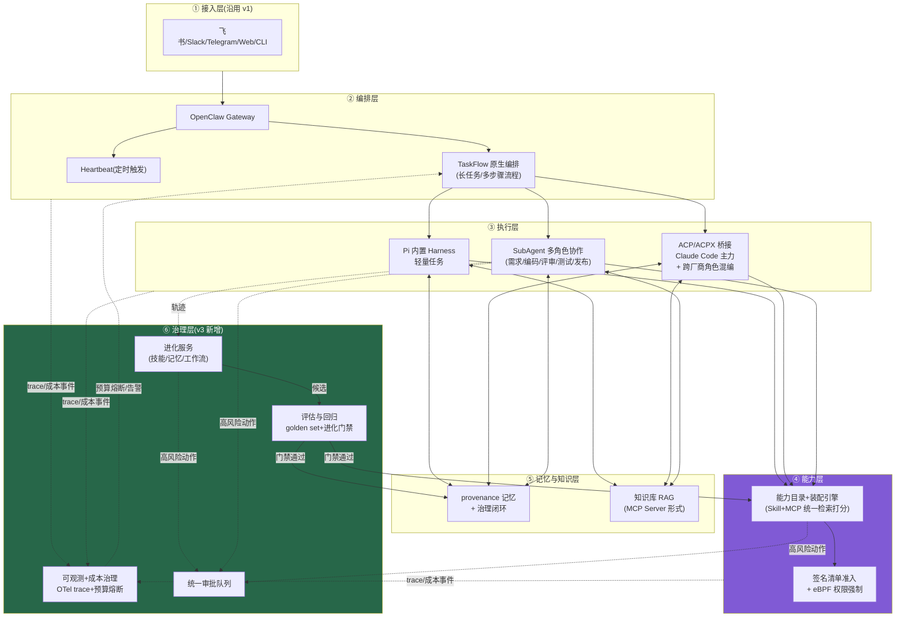
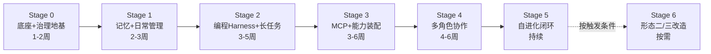

# OpenClaw + Harness 智能工作管理系统 v3.0 整体升级方案

## ——原生优先 / 验证驱动进化 / 三形态渐进演进

> 版本:v3.0 | 撰写日期:2026-07-02
> 承接文档:`openclaw-harness-system-design.md`(v1.0)、`openclaw-harness-v2-distributed.md`(v2.0)
> 说明:本方案基于 2026 年 7 月时点的最新生态调研,对 v1/v2 做整体升级。核心变化:**用 OpenClaw 2026 上半年新增的原生能力(TaskFlow、记忆 provenance、签名技能清单)替换 v2 中大量自建设计;新增评估回归与可观测成本治理两个 v1/v2 缺失的子系统;把 v2「单机→K8s 微服务」的断崖式跳变改为三形态渐进演进**。目标规模按「个人/小团队」设计,团队级扩展点单独标注。

---

## 目录

0. [调研校准:2026-07 时点的关键事实变化](#0-调研校准2026-07-时点的关键事实变化)
1. [诊断:v1/v2 的七个薄弱点](#1-诊断v1v2-的七个薄弱点)
2. [v3.0 设计总纲](#2-v30-设计总纲)
3. [核心升级设计](#3-核心升级设计)
4. [架构演进三形态与升级触发条件](#4-架构演进三形态与升级触发条件)
5. [渐进实施路线图](#5-渐进实施路线图)
6. [安全增量(2026 上半年事件更新)](#6-安全增量2026-上半年事件更新)
7. [与 v1/v2 的映射表](#7-与-v1v2-的映射表)
8. [参考资料](#8-参考资料)

---

## 0. 调研校准:2026-07 时点的关键事实变化

v1(2026-07-01 撰写)与 v2 的多处设计建立在当时的生态现状上。本轮调研(2026-07-02)确认了以下变化,**每一条都直接影响架构决策**:

| # | 新事实 | 来源 | 对 v1/v2 的影响 |
|---|---|---|---|
| 1 | **TaskFlow 原生编排层已发布**(2026.3.31 "Task Brain" 更新引入):官方定义为"位于后台任务之上的编排基底",管理持久化多步骤流程,自带状态、修订跟踪与同步语义;同批次移除 `nodes.run`,统一执行模型,是该框架发布以来最大的破坏性变更 | 官方文档 `docs.openclaw.ai/automation/taskflow`、MindStudio/36kr 报道 | **v2 §4.5 自建的「持久化 Job 存储 + 状态机 + Watchdog」大部分被原生能力覆盖**——v3 改为 TaskFlow 原生优先,自建调度降级为可选扩展层 |
| 2 | **记忆 provenance(来源标注)机制上线**:每条记忆携带 `observed`(来源观察)/ `inferred`(模型推断)/ `confirmed`(用户确认)/ `imported`(转录导入)标签,跨模型更换保持连续性 | MindStudio(2026 年 4 月更新解读) | v1 §4.2.3 的记忆治理可升级为「provenance × 风险」双维分级,比单一 `pending_review.md` 缓冲区更精细 |
| 3 | **签名技能清单 + 内核级最小权限**(v2026.4.12):技能必须声明可访问的文件路径、网络端点、shell 命令,运行时用 eBPF 强制执行——声明外的访问在内核层直接阻断 | MindStudio(April 2026 update) | v1 §4.5.3 / v2 §4.3 的技能安全模型可大幅升级:从「扫描 + 信誉检查」升级为「签名清单 + 声明式权限 + 内核强制」三层 |
| 4 | **供应链威胁仍在持续且绕过了官方筛查**:ClawHavoc 实际为单一威胁者上传 341 个恶意技能(2026-01-27~29,含键盘记录器、Atomic Stealer、反向 shell);后续审计发现全生态约 31,000 个技能中 7.6%(2,371 个)含危险模式;Snyk ToxicSkills 扫描 3,984 个技能发现 1,467 个恶意载荷、36% 存在提示注入特征;Unit 42 证实 2026 年 2~5 月间仍有 5 个恶意技能**同时绕过** ClawHub 集成的 VirusTotal 与 ClawScan 筛查 | The Hacker News、Snyk、Unit 42、Dark Reading | 修正 v1 §7.1 的数字;更重要的结论:**市场侧筛查不可作为信任边界**,本地防线(签名清单+装配最小化+运行时监控)必须独立成立 |
| 5 | **ACPX 打破厂商边界**:`openclaw/acpx`(MIT)是 ACP 的无头 CLI 客户端,可让 Claude Code 编排 Codex 写测试、Gemini CLI 做评审——跨厂商多智能体编排已通过标准协议实现,不再依赖终端抓取;ACP 本身由 Zed 发起(2025-08),JetBrains 已于 2026-02 加入共同维护 | casys.ai、dev.to、ACP 官方 | v2 §4.4 多角色协作的「角色池」可以跨厂商混编(不同角色用不同厂商 harness 做交叉验证),且 ACP 协议的中立性与存续性风险显著下降 |
| 6 | **运行时可切换模型提供方**(Provider Manifest,2026 年 4 月):6+ 模型提供方无需重建即可运行时切换 | MindStudio | 强化「模型分级路由」的可操作性,成本治理(§3.5)有了原生开关 |
| 7 | **安全修复节奏**:2026.3.11 修复 WebSocket 劫持漏洞(共享开发机上恶意本地进程可截获 agent-to-skill 通信);2026.6.11 为可靠性更新,含更安全的管理默认值 | Releasebot、官方 releases | 佐证 v1「及时更新」加固项;WebSocket 劫持案例说明**同机多用户环境**是新攻击面,单机部署也要做进程隔离 |
| 8 | **Agent 可观测标准成熟**:OpenTelemetry GenAI 语义约定 + 评估回归(golden dataset、CI 门禁、生产流量采样评估)已成为 2026 年 agent 系统的通行实践 | OpenTelemetry 官方博客、MLflow、Arthur 等 | v1/v2 完全缺失「评估层」——自进化闭环里的「沙箱验证」没有客观基准可依,这是本次升级要补的最大缺口之一 |

> ⚠️ 与 v1/v2 相同的提醒:OpenClaw 生态仍在快速演进(月度大版本节奏),以上事实在你实施时可能又有变化,具体命令与配置字段以安装版本的官方文档为准。

---

## 1. 诊断:v1/v2 的七个薄弱点

结合调研结果,对两版方案做整体诊断。前两条是「事实过时」,后五条是「设计缺口」:

| # | 薄弱点 | 具体表现 | v3 对策 |
|---|---|---|---|
| 1 | **v2 重复造轮子:自建任务调度** | v2 §4.5 设计了完整的 Job 表、状态机、lease 续约、Watchdog——TaskFlow 原生已覆盖单机场景的持久化多步骤编排与状态修订跟踪 | 原生优先:TaskFlow 承载长任务;自建调度层只在「多节点竞争消费」真实出现时作为扩展启用(§3.1) |
| 2 | **技能安全模型落后于官方能力** | v1 §4.5.3 依赖「扫描+信誉」,v2 §4.3 依赖「registry 元数据+分级审批」——都未利用签名清单与内核级权限强制 | 三层防线重构:签名清单准入 → 装配最小化 → eBPF 运行时强制(§3.3) |
| 3 | **缺评估回归层(最大设计缺口)** | 两版方案的「自进化」都依赖「沙箱验证+历史用例回放」,但从未定义:基准用例集从哪来、怎么维护、通过标准是什么、进化后如何防止回归。没有客观评估,「自进化」实际退化为「模型自评+人工抽查」 | 新增评估与回归子系统:golden set 管理、进化门禁、生产采样评估(§3.4) |
| 4 | **可观测与成本治理缺位/滞后** | v1 仅在 §9.2 提示成本风险;v2 把可观测放在 Phase 8(分布式之后)。实际上单机阶段就需要 trace、token 成本核算与预算熔断——无人值守长任务 + 自进化反思都是持续烧钱的环节 | 新增可观测与成本治理子系统,从 Stage 0 就上线(§3.5) |
| 5 | **单机→微服务是断崖,没有中间形态** | v2 Phase 7 从单进程直接跳到 K8s + NATS/Kafka + Postgres + 服务网格,对个人/小团队是不可行的一步;v2 §9 自己也承认这点,但没给出中间路径 | 定义三形态演进:单机加固版 → 状态外置版(docker-compose 级)→ 服务拆分版,每步有明确触发条件与回退路径(§4) |
| 6 | **审批疲劳未被设计** | v1/v2 在记忆、技能、装配、多角色、发布五处都设了人工审批点,但没有统一的审批体验设计——分散的审批请求会让人麻木地「全部通过」,审批形同虚设 | 统一审批队列:所有待审事项收敛为单一渠道的结构化卡片,带风险分级、批量操作与「审批质量」自监控(§3.6) |
| 7 | **上下文工程未成体系** | 两版都提到「按需检索而非全量注入」,但没有上下文预算的量化设计:核心记忆+技能元数据+装配结果+协作消息同时注入时,上下文膨胀直接推高成本并稀释注意力 | 明确各注入源的 token 预算与降级顺序,装配引擎输出受预算约束(§3.7) |

v1 的五条设计原则(本地优先、渐进式自主权、人在回路、可审计可回滚、关注点分离)与「致命三角」安全框架**继续完全有效**,是 v3 的公理层,不再重复展开。

---

## 2. v3.0 设计总纲

### 2.1 三条设计主线

1. **原生优先(Native-first)**:凡是 OpenClaw 2026 已原生提供的能力(TaskFlow、provenance 记忆、签名技能清单、SubAgent、Provider Manifest),直接采用并在其上做薄封装;自建组件只保留在原生能力确实覆盖不到的地方(评估层、成本治理、统一审批、能力装配打分)。**每引入一个自建组件都要回答:官方半年内会不会把它做出来?如果大概率会,就做成可拆卸的薄层。**
2. **验证驱动进化(Evaluation-gated evolution)**:一切「自进化」(技能/记忆/工作流)的转正必须通过评估层的客观门禁,而不是沙箱里「看起来能跑」。评估层同时服务于日常质量监控与升级决策(何时该进入下一架构形态,用指标说话)。
3. **形态渐进(Staged topology)**:架构不再是「单体 or 微服务」二选一,而是三个可停留的稳定形态,每个形态自洽可长期运行,升级由量化触发条件驱动,且可回退。

### 2.2 架构总览(逻辑视图,与物理形态解耦)

与 v2 架构图的本质区别:**⑥治理层取代了 v2 的「独立微服务集群」成为升级重点**——治理层的四个组件在三种物理形态下都存在(单机时是进程内模块+本地存储,分布式时才是独立服务),这就是「逻辑架构与物理形态解耦」的含义。

---

## 3. 核心升级设计

### 3.1 长任务编排:TaskFlow 原生优先,自建调度降级为扩展层

**替换 v2 §4.5 的核心结论**:单机与小规模场景下,长任务的持久化、多步骤状态管理、修订跟踪直接交给 TaskFlow;v1 的 Plan→Review→Execute→Verify 范式映射为 TaskFlow 的 flow 定义,`/goal` 系列管理接口封装在 TaskFlow 之上。

| v2 自建设计 | v3 处理方式 |
|---|---|
| 持久化 Job 表(Postgres) | **由 TaskFlow 原生状态承载**(形态一/二);仅在形态三多节点竞争消费时外置 |
| 任务状态机(PENDING→…→ESCALATED) | 保留状态机语义,实现为 TaskFlow flow 的阶段定义,不再自建存储 |
| lease 续约 + 竞争消费 | 形态一/二不需要(单 worker);形态三启用时再引入 |
| Watchdog 巡检 | **保留但简化**:一个 Heartbeat 任务周期性调 TaskFlow 状态 API,检测「长时间无进展/重试逼近上限」的 flow,触发升级人工——约几十行胶水逻辑,不是独立服务 |
| 迭代熔断(v2 §4.4.3) | **原样保留**,实现为 flow 阶段间的计数守卫,超阈值转 ESCALATED |

**依然自建的部分**:ESCALATED(升级人工)语义与统一审批队列(§3.6)的对接、预算熔断(§3.5)对 flow 的暂停能力——这两点是治理需求,TaskFlow 不管。

> 📌 风险标注:TaskFlow 是 2026.3.31 才引入的新层,且该版本包含破坏性变更(移除 `nodes.run`)。建议锁定版本、在非关键任务上试运行 2 周再迁移核心流程;v2 的自建调度设计**保留为文档附录**,作为 TaskFlow 不满足需求时的后备方案,这正是「薄封装、可拆卸」原则的体现。

### 3.2 记忆治理升级:provenance × 风险双维分级

v1 §4.2.3 的四阶段闭环(提取→巩固→治理→检索)保留,治理阶段的分级规则升级为二维矩阵,利用原生 provenance 标签:

| provenance \ 风险 | 低风险(偏好/事实类) | 高风险(影响自动执行的规则、对人的判断) |
|---|---|---|
| `confirmed`(用户确认) | 直接生效 | 直接生效(用户已确认即最高信任) |
| `observed`(来源观察) | 直接生效,定期抽检 | 进入统一审批队列 |
| `imported`(转录导入) | 直接生效,标记来源 | 进入统一审批队列 |
| `inferred`(模型推断) | 生效但降权(检索时排序靠后,标注"推断") | **强制审批,且默认不用于自动执行决策** |

关键增量:**检索侧也消费 provenance**——注入上下文时附带来源标签,让执行 agent 知道「这条记忆是推断出来的」,从源头缓解 v1 担心的错误累积/漂移问题;每周记忆健康检查(v1 已有)升级为按 provenance 分层抽样:`inferred` 类抽检比例最高。

### 3.3 技能供应链:三层防线重构

利用 2026.4.12 的签名清单能力,把 v1 §4.5.3 / v2 §4.3 的安全模型重构为纵深三层,**且第 4 条调研事实(恶意技能绕过官方双重筛查)决定了每层必须独立成立,不依赖上一层**:

1. **准入层(静态)**:只安装带签名清单的技能;清单中声明的文件路径/网络端点/shell 命令超出技能用途所需的,直接拒绝(「一个天气播报技能声明访问 `~/.ssh`」这类清单-用途不匹配是最强的恶意信号);保留 VirusTotal/ClawScan 扫描,但仅作参考信号而非放行依据。
2. **装配层(任务时)**:能力装配引擎(沿用 v2 §4.3 设计)按最小子集绑定;**能力目录 schema 新增字段**:`manifest_signature`(签名指纹)、`declared_permissions`(清单声明的权限,替代 v2 中手工维护的 `required_permissions`)、`manifest_scope_ratio`(声明权限与历史实际使用权限的比值,持续偏大说明过度声明,降低打分)。
3. **运行时层(动态)**:eBPF 强制执行声明边界(原生能力);自建部分是**越权尝试告警**——内核阻断的访问尝试本身就是高价值威胁情报,写入审计日志并在多次触发时自动将技能降级为 `staging` 并进审批队列。

自主生成的技能走完全相同的三层:进化服务生成候选时**必须同时生成权限清单**,声明范围超出其训练轨迹中实际使用范围的,评估门禁直接打回。

### 3.4 评估与回归子系统(v3 新增,填补最大缺口)

**定位**:为「自进化」提供客观门禁,为日常运行提供质量基线,为架构升级决策提供数据。没有这一层,v1/v2 的所有「沙箱验证」都缺乏判据。

**三个组成部分**:

1. **Golden Set(基准用例库)**:按任务类型(问答/分诊/编码/调研/项目同步)维护基准用例,每条含输入、期望产出的结构化断言(「输出必须含 X 字段」「测试必须通过」「不得调用 Y 类工具」)、权重。来源:人工种子用例(每类 10~20 条起步)+ **从生产轨迹自动候选**(被人工点赞/无打回完成的任务,脱敏后进入候选池,人工确认后入库)——用例库本身也是渐进积累的,不要求一步到位。
2. **进化门禁(Evolution Gate)**:技能/记忆规则/工作流补丁转正前,在 staging 环境对相关 golden 用例回放,通过率低于阈值(参考值 90%)不予转正;**同时跑回归**:变更不得使其他类型用例的通过率下降。这取代了 v1 §4.5.2 中语焉不详的「沙箱验证」,v2 §4.6.2 的金丝雀灰度保留为门禁之后的第二道(先门禁、再灰度、再全量)。
3. **生产采样评估**:按比例(参考 5~10%)抽样已完成任务,用轻量模型按 rubric 打分(任务完成度/是否偏题/成本合理性),结果进入可观测面板;连续劣化触发告警——这是「多轮对话间的系统性失败」(上下文漂移、幻觉累积)的主要探测手段,单次调用监控看不到这类问题。

**实现形态**:形态一下就是「一个 SQLite 用例库 + 一组回放脚本 + 一个 Heartbeat 评估任务」,不需要引入独立评估平台;形态三可平滑替换为 MLflow/Langfuse 类平台,但 schema 从一开始就对齐 OTel GenAI 语义约定,保证数据可迁移。

> 📌 **设计决议(2026-07-04,基线内细化):技能准入反臃肿规约**——技能库不会死于单个坏技能,会死于大量平庸的重复技能(检索分流、触发冲突、元数据清单膨胀、审计面扩大)。原方案的防线集中在使用时(最小装配)与运行后(定期体检),入口把关缺失,现补三条准入硬规则,作为进化门禁(本节第 2 项)的前置检查:
>
> 1. **先查重后生成**:候选技能入门禁前,对能力目录做语义检索;与现有技能相似度超阈值(参考 0.85)→ 强制转为「演进现有技能」(版本升级/触发扩展),禁止另立新条目——默认答案是"改旧的",新建须证明不可合并;
> 2. **触发冲突零容忍**:新技能触发模式与现有技能重叠但行为不一致 → 阻断而非警告,人工裁决取代(supersede)关系后才可继续;
> 3. **活跃技能数量上限**:个人/小团队规模参考 30-50,超限新增必须伴随一次淘汰(强制换血)。
>
> 配套指标转向:技能库健康度 KPI 不是数量而是**「检索命中即正确」率**——golden set 增设 skill-selection 断言(任务 X 应选中技能 Y),选错技能计为回归。v1 §4.5.2 的定期体检保留为兜底,但入口把关优先于事后清理。

### 3.5 可观测与成本治理子系统(v3 新增,Stage 0 即上线)

**为什么提前到 Stage 0**:无人值守长任务 + 心跳巡检 + 进化反思是三个持续消耗 token 的环节,v2 §9 也承认「虚假并行」「无进展空转」类问题烧钱且难察觉——没有成本可见性之前,任何自动化都不该无人值守。

| 能力 | 形态一实现(单机,轻量) | 说明 |
|---|---|---|
| 统一 trace | 每个任务/flow/协作会话分配 trace id,贯穿所有模型调用与工具调用,落本地 SQLite/JSONL,schema 对齐 OTel GenAI 语义约定 | v2 只在分布式语境下讲 Jaeger;实际上单机排查「这个任务为什么花了 40 万 token」同样需要 trace |
| 成本核算 | 每次模型调用记录 token 数×单价,按任务/技能/角色/flow 聚合 | Provider Manifest 的运行时切换能力让「降级到便宜模型」可以自动执行 |
| **预算熔断** | 每个长任务创建时携带预算上限(token 或金额);达到 80% 告警,100% 暂停 flow 并进审批队列,人工决定追加预算或终止 | **这是无人值守的前提条件**,与迭代熔断(§3.1)互补:迭代熔断防空转,预算熔断防失控 |
| 质量告警 | 生产采样评估(§3.4)分数连续 N 次低于基线、人工打回率突增、某技能成功率骤降 → 主动推送 | 告警走原有 IM 渠道,复用接入层 |
| 面板 | 形态一:每日成本/质量摘要并入晨报(复用 v1 §5.1 晨报机制);形态二起:Grafana | 不为单机引入 Prometheus 全家桶 |

### 3.6 统一审批队列(v3 新增)

v1/v2 分散在五处的人工审批(记忆转正、技能转正、装配确认、协作升级、发布动作)收敛为单一队列,通过固定 IM 渠道以结构化卡片推送:

- 卡片要素:类型、风险等级、一句话摘要、**可读 diff 或具体动作描述**、建议(批准/拒绝及理由)、超时策略(高风险默认超时即拒绝,低风险可配置超时即通过);
- 支持批量操作与「按类型委托」(如「装配确认类连续 20 次批准且事后无打回 → 建议转为自动+抽检」——**授权范围本身按渐进式自主权原则动态扩大**,且扩大动作也要人工确认一次);
- **审批质量自监控**:统计每类审批的人工改判率。改判率趋近零说明该类审批可降级为抽检(减负);改判率高说明上游生成质量差,信号回传给进化服务。审批疲劳的解法不是减少审批点,而是让审批点随信任积累自动退场。

> 📌 **设计决议(2026-07-02,实施期确认)**:渠道身份数 = 需要独立人机交互界面的编排单元数,**≠ 内部角色数**。多角色协作(§3.8)的角色间通信走内部 mailbox,不经过 IM 渠道;人只消费进度报告与审批请求两类消息,统一收敛到单一渠道。旧架构的 9-bot 多账号结构确认废弃;当前接入为 **WebChat 单渠道**(经回环 Gateway 服务,无外部渠道 token,攻击面最小)。多渠道身份仅在形态三多 Gateway 实例时重新评估。

### 3.7 上下文预算(设计规约,非组件)

给系统提示词的各注入源设定 token 预算与超支降级顺序(参考值,按所用模型上下文窗口比例配置):

核心记忆摘要 ≤10%、技能元数据(装配后的最小子集)≤10%、任务简报与协作消息 ≤15%、检索知识 ≤20%,其余留给对话与工具产出。超支时按「检索知识→协作历史压缩为摘要→技能元数据只留 name+一句话描述」的顺序降级。装配引擎(§3.3)的打分输出必须服从该预算——这是「最小权限装配」在成本维度的对应物:**最小注意力装配**。

### 3.8 多角色协作:沿用 v2 骨架,两点升级

v2 §4.4 的角色集、反馈环拓扑、迭代熔断、分歧仲裁设计整体保留,升级两点:

1. **跨厂商混编(基于 ACPX)**:评审角色可用与编码角色不同厂商的模型/harness(如 Claude Code 编码、Codex 评审),天然缓解「同源模型互评的盲区一致性」;ACPX 的无头 CLI 形态使这不再需要终端抓取类脏手段。默认仍单厂商起步(运维简单),跨厂商作为评审质量不达标时的升级选项。
2. **角色轨迹进评估**:每轮打回/失败的结构化摘要除了供进化服务提炼(v2 已设计),同时进入 golden set 候选池——真实失败案例是最有价值的回归用例。

---

## 4. 架构演进三形态与升级触发条件

取代 v2「Phase 7 一步跳到 K8s」的断崖设计。三个形态都是**可长期停留的稳定态**,不是过渡态:

### 形态一:单机加固版(默认起点,多数个人场景的终点)

单进程 Gateway + TaskFlow + 本地文件/SQLite;治理层四组件以进程内模块+本地存储实现;容器化部署(单 compose 文件),网络只监听回环/Tailscale。**v1 架构 + TaskFlow + 治理层 = 形态一**。

### 形态二:状态外置版(docker-compose 级,不引入 K8s)

保持单 Gateway,但把三类状态外置:任务/协作状态与能力目录 → Postgres(+pgvector),缓存/审批队列 → Redis,大对象 → MinIO。Markdown 双写保留(v2 §6 的边界划分表原样沿用)。执行层开始分离:开发角色的 SubAgent/ACP 会话跑在独立容器,与 Gateway 隔离。**这是 v2 缺失的中间形态:拿到了「状态不怕重启、执行环境隔离」八成收益,只付出 docker-compose 级运维成本。**

### 形态三:服务拆分版(v2 的目标形态,按瓶颈拆)

按 v2 §3/§5 的设计执行,拆分顺序沿用 v2 建议(装配与调度服务优先),此时因状态已在形态二外置,拆分主要是「把模块变成服务」而非「边拆边迁数据」,风险大幅降低。

### 升级触发条件(用可观测数据说话,而非感觉)

| 从 → 到 | 触发信号(满足任意两条再升级) | 回退路径 |
|---|---|---|
| 形态一 → 二 | ① 每周因进程重启丢失/中断长任务 ≥1 次;② 并发长任务经常 ≥3 个且互相拖慢;③ 出现第二个日常使用者;④ SQLite 归档记忆查询可感知变慢 | Postgres 数据物化回 Markdown/SQLite,回到形态一(双写机制保证随时可回) |
| 形态二 → 三 | ① 单 Gateway CPU/内存成为常态瓶颈;② 装配/评估等某个模块的故障反复拖垮整个进程;③ 多团队使用需要租户隔离;④ 任务队列深度持续增长需要多 worker 竞争消费 | 服务合并回单进程(模块本就按服务边界设计,合并成本低) |

**明确写下:如果触发信号一直不出现,永远停留在形态一/二是正确决策,不是保守。** 这是 v2 §9 第 5 条取舍的制度化。

---

## 5. 渐进实施路线图

在 v1 Phase 0-5 / v2 Phase 4-8 基础上重排。每个 Stage 交付后系统都处于可用稳定态,可以在任意 Stage 停下来:

| Stage | 目标 | 关键产出 | 相对 v1/v2 的变化 |
|---|---|---|---|
| **0 底座+治理地基** | 最小可用系统 + 从第一天就有可观测 | 部署 Gateway(锁定 ≥2026.6.11 版本)、SOUL/AGENTS 配置、1-2 个 IM 渠道;**trace+成本记录上线;统一审批队列上线(先只接高风险动作);网络/账号/容器隔离落地** | v1 Phase 0 + 把 v2 Phase 8 的核心项和 v3 §3.5/3.6 前移到第一天 |
| **1 记忆+日常管理** | 晨报/待办/分诊可用 | `memory/` 结构化 + **provenance 治理矩阵生效**;知识库初始导入;晨报并入成本/质量摘要 | v1 Phase 1 + §3.2 升级 |
| **2 编程 Harness+长任务** | 单项目「需求→代码→PR」闭环 + 无人值守基线 | ACP 接入 Claude Code;**TaskFlow 承载长任务**(先非关键任务试跑 2 周);迭代熔断+预算熔断生效;golden set 种子用例(编码类 10-20 条)开始积累 | v1 Phase 2 + §3.1;v2 的自建调度设计归档为后备 |
| **3 MCP+能力装配** | 外部系统接入 + 装配引擎「推荐模式」 | 项目管理/代码托管/日历 MCP 接入;能力目录建立(含签名清单字段);装配引擎先推荐后执行;**技能三层防线生效** | v1 Phase 3 + v2 Phase 4 合并,叠加 §3.3 |
| **4 多角色协作** | 开发任务多角色+反馈环 | 先「编码+评审」两角色跑通,再扩展;协作轨迹进 golden set 候选池;评审质量不达标时启用跨厂商混编 | v2 Phase 5 + §3.8 |
| **5 自进化闭环** | 技能/记忆/工作流统一进化 | **进化门禁上线是前置条件**(无门禁不开自动转正);先全人工复核 2-4 周 → 门禁+灰度 → 按审批改判率逐类放开;工作流元进化最后启用 | v1 Phase 4 + v2 Phase 6,叠加 §3.4 门禁 |
| **6 形态升级改造** | 形态二/三 | 严格按 §4 触发条件启动;先形态二,停留观察 ≥1 个月再评估形态三 | 取代 v2 Phase 7 |

与 v2 路线图的两个关键区别:**治理地基(可观测/审批/隔离)从最后一个阶段移到第一个阶段**;**自进化的解锁条件从「时间到了」改为「评估门禁就绪」**。

---

## 6. 安全增量(2026 上半年事件更新)

v1 第 7 章(致命三角 + 十条加固清单)与 v2 第 7 章(微服务六风险)继续有效。本章只列本轮调研带来的增量:

| # | 增量 | 依据与动作 |
|---|---|---|
| 1 | **数字修正**:ClawHavoc 为 341 个恶意技能(非 v1 所记 300+/确认 800+);最新审计口径为约 31,000 技能中 7.6% 含危险模式;ToxicSkills 为 3,984 个样本中 1,467 个恶意载荷、36% 提示注入特征 | 更新 v1 §7.1 表格引用 |
| 2 | **官方筛查可被绕过是实证结论**:Unit 42 证实 5 个恶意技能同时通过 VirusTotal 与 ClawScan | 本地三层防线(§3.3)不得依赖市场侧筛查;「已通过 ClawHub 扫描」不进入信任计算 |
| 3 | **同机进程间攻击面**:2026.3.11 修复的 WebSocket 劫持说明共享机器上本地恶意进程可截获 agent-to-skill 通信 | 即使形态一也用容器隔离 Gateway 与其他工作负载;不在共享开发机上裸跑 |
| 4 | **签名清单成为新基线**:v2026.4.12 起技能权限声明+eBPF 强制可用 | 无签名清单的技能一律不装;将「清单-用途不匹配」列为最高优先级拒绝信号 |
| 5 | **预算熔断是安全机制不只是成本机制**:被提示注入劫持的 agent 的典型行为是异常的工具调用与 token 消耗模式 | 成本异常告警(§3.5)接入安全响应:预算异常 → 暂停 flow → 审批队列人工检视,而非仅记账 |

---

## 7. 与 v1/v2 的映射表

| v1/v2 内容 | v3 处置 |
|---|---|
| v1 五条设计原则、致命三角、业务四场景映射(§5)、目录结构(§6) | **保留**,目录结构新增 `eval/`(golden set 与回放结果)与 `governance/`(审批记录、成本账本) |
| v1 §4.2 记忆闭环 | 保留,治理阶段升级为 provenance × 风险矩阵(§3.2) |
| v1 §4.5 技能自进化 | 保留流程,验证环节替换为评估门禁(§3.4),安全模型替换为三层防线(§3.3) |
| v2 §2 现实基线核查、§6 状态边界划分、§9 取舍清单 | **保留**,§9 的判断制度化为 §4 升级触发条件 |
| v2 §4.3 能力装配引擎 | 保留,目录 schema 增加签名清单字段,输出受上下文预算约束 |
| v2 §4.4 多角色协作 | 保留,增加跨厂商混编与轨迹进评估(§3.8) |
| v2 §4.5 自建长任务调度 | **替换**为 TaskFlow 原生优先;自建设计归档为形态三后备(§3.1) |
| v2 §4.6 统一进化治理 | 保留金丝雀灰度,前置评估门禁(先门禁再灰度) |
| v2 §5 K8s 部署拓扑 | **降级**为形态三专属内容,前置形态二(§4) |
| v2 Phase 7-8 路线 | **重排**:治理前移至 Stage 0,分布式化移至按需触发的 Stage 6(§5) |

---

## 8. 参考资料(v3 新增调研来源)

**OpenClaw 2026 上半年演进**
- TaskFlow 官方文档:`docs.openclaw.ai/automation/taskflow`
- 官方 releases 与 2026.6.11 更新说明(Releasebot 汇总)
- MindStudio《OpenClaw April 2026 Update: 5 New Features That Make It a Serious Agentic Runtime》(TaskFlow、记忆 provenance、签名清单+eBPF)
- MindStudio《OpenClaw April 2026: 6 Model Providers You Can Now Swap at Runtime》(Provider Manifest)
- 36kr《104 People Rewrote the Underlying Code: OpenClaw Equipped with "Task Brain"》

**供应链安全(2026 年 1-5 月)**
- The Hacker News《Researchers Find 341 Malicious ClawHub Skills Stealing Data from OpenClaw Users》
- Snyk ToxicSkills 审计报告(3,984 样本 / 1,467 恶意载荷 / 36% 提示注入)
- Unit 42《OpenClaw's Skill Marketplace and the Emerging AI Supply Chain Threat》(绕过双重筛查实证)
- Dark Reading《More Malicious OpenClaw Skills Threaten AI Supply Chain》

**ACP / 跨厂商编排**
- OpenClaw 官方文档 ACP agents:`docs.openclaw.ai/tools/acp-agents`
- casys.ai《ACPX Inside Claude Code: Practical Multi-Agent Orchestration》
- DEV Community《2026 Complete Guide: OpenClaw ACP》

**评估与可观测**
- OpenTelemetry 官方博客《AI Agent Observability — Evolving Standards and Best Practices》
- MLflow《What Is Agent Observability? A 2026 Developer Guide》
- Arthur《Choosing an AI Observability Platform in 2026》

> ⚠️ 一贯提醒:OpenClaw 保持月度大版本节奏且含破坏性变更(如 2026.3.31 移除 `nodes.run`),实施前以安装版本官方文档为准;本文档为架构设计方案,不构成安全审计报告或生产部署保证。

---

*本文档为 v1.0/v2.0 的整体升级方案,建议三份配合阅读:v1 提供基础设计与安全框架,v2 提供分布式形态的完整细节(形态三时启用),v3 提供当前时点的修正、新增治理层与渐进演进路径。*
